# KIYA 360 — Target Architecture Definition (Phase 1C)

- **Document ID:** `ARCH-04`
- **Phase:** Phase 1C — Target Architecture Definition
- **Status:** `PROVISIONAL BASELINE`
- **Date:** 14 September 2026
- **Authors:** Principal Enterprise Architect, Solution Architect, Architecture Governance Lead
- **Primary Source:** `source/KIYA360_BRD.pdf` (Version 2.0, 13 September 2026)
- **Traceability Baseline:** `docs/00-requirements/` (`01-master-requirements.md` through `36-phase-0-completion-assessment.md`)
- **Architecture Framework:** `docs/02-architecture/01-architecture-strategy-and-decision-framework.md` (Phase 1A)
- **Candidate Evaluation:** `docs/02-architecture/02-candidate-architecture-evaluation.md` (Phase 1B)

---

## 1. Executive Summary & Architectural Identity

### 1.1 What Kind of System KIYA 360 Is

KIYA 360 is an integrated, enterprise-grade **Customer Relationship Management (CRM) and Enterprise Resource Planning (ERP)** business operating platform. It unifies front-office engagement (marketing, sales, customer service, field operations) with back-office execution (procurement, inventory, manufacturing, quality, financial accounting, human resources, and enterprise performance management).

KIYA 360 is explicitly designed as a **unified business platform**, not a collection of disconnected software silos. It provides:
1. **A Single Conceptual Data Model:** Authoritative shared master data (Customer, Supplier, Item, Facility, Chart of Accounts, Organization Structure) referenced across all operational touchpoints without duplicate data entry (`DEC-007`).
2. **Unified Transaction Lifecycles:** Seamless cross-module business flows that bridge organizational silos with end-to-end status visibility.
3. **Shared Platform Foundations:** Centrally governed multi-tenancy, workflow/approvals (`SF-005`), audit trails (`SF-008`), document management (`SF-007`), role-based access control (`SF-002`), notification dispatch (`SF-006`), and statutory tax determination (`MOD-18`).
4. **Horizontal AI & Analytics:** Embedded machine intelligence (`MOD-25` / `SF-010`) and operational business intelligence (`MOD-22` / `MOD-23` / `SF-011`) acting across domain boundaries rather than siloed within individual modules.

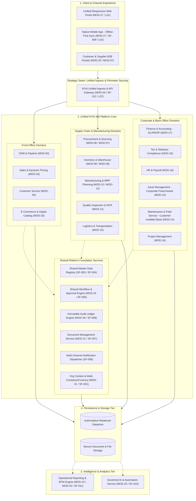

### 1.2 Distinction: Logical vs. Application vs. Deployment Architecture

To prevent architectural anti-patterns, this target architecture enforces three distinct perspectives:
- **Logical Architecture (This Document — Phase 1C):** Defines the conceptual boundaries, responsibilities, relationships, data ownership, and invariant rules governing the platform, completely independent of runtime packaging or hosting mechanics.
- **Application & Integration Architecture (Phase 1D):** Defines the concrete module mappings (all 28 BRD modules), interface boundaries, data exchange patterns, and cross-domain interaction models.
- **Deployment & Operations Architecture (Phase 1E):** Defines the runtime infrastructure, containerization, tenant isolation topologies, network zoning, scaling models, and disaster recovery mechanics.

---

## 2. The 14 Conceptual Architecture Layers

The KIYA 360 logical architecture is structured into 14 distinct layers. Each layer has strict responsibilities, clear dependency directions, and defined interface boundaries.

| Layer | Conceptual Layer | Core Architectural Responsibility | Invariant Boundary Rules |
| :--- | :--- | :--- | :--- |
| **L01** | **User Experience (UX) / Client** | Presentation of unified enterprise UI; workspace navigation; dynamic form rendering; responsive desktop and tablet layouts. | No business logic execution or direct database access. Interacts exclusively via Layer L07 (Unified Ingress / API Gateway). |
| **L02** | **Mobile Experience** | Mobile-native field operations; barcode/QR scanning; offline transaction capture; bidirectional data synchronization (`SF-009` / `MOD-27`). | Operates on local encrypted storage when offline; mutates via queued idempotent actions; submits through synchronization adapter. |
| **L03** | **Application / Business Capability** | Orchestration of business use cases; user intent processing; coordination across domain entities. | Does not bypass domain rules; delegates persistence to Layer L08; delegates approvals to Layer L06 (`SF-005`). |
| **L04** | **Shared Platform / Foundation** | Universal services required by all modules: Multi-tenancy context, auto-numbering (`SF-013`), multi-currency, localization, and organization context (`SF-001`). | Independent of specific business domain semantics; reusable across all 28 modules. |
| **L05** | **Transaction / Domain Processing** | Encapsulation of core business entities, operational business status lifecycles (`CD-002`), and double-entry financial posting rules. | Absolute guardian of business integrity and financial immutability (`DEC-009`). Reversible operational states; strictly balanced accounting. |
| **L06** | **Workflow / Automation** | Dynamic approval rule evaluation, escalation hierarchies, SLA monitoring, multi-level authorizations, and state transitions (`SF-005` / `MOD-24`). | Decoupled from entity schema; triggered by business events; governs transitions of operational business status. |
| **L07** | **Integration / API Layer** | External and internal API contract termination, rate limiting, authentication/authorization enforcement, and webhook dispatching (`SF-012` / `MOD-26`). | Single ingress point for all non-direct UI requests; enforces tenant boundary and request auditing. |
| **L08** | **Data / Persistence Layer** | Authoritative relational data persistence, schema enforcement, transaction boundary management, and multi-tenant isolation (`SF-003`). | Single source of truth for transactional state. Direct SQL writes prohibited except through domain layer abstractions. |
| **L09** | **Analytics / BI / EPM Layer** | Decoupled operational reporting, analytical rollups, KPI aggregation, financial consolidation, and budgeting/forecasting (`SF-011` / `MOD-22` / `MOD-23`). | Read-only access to transactional data (or read replicas/lake); must never block operational transactional workloads. |
| **L10** | **AI / Intelligent Automation** | Machine learning inference, predictive scoring, automated document extraction, natural language query, and RPA task automation (`SF-010` / `MOD-25`). | Advisory and assistive; strictly prohibited from silently overriding financial controls or transactional rules without human review. |
| **L11** | **Document / File Management** | Secure object storage, metadata indexing, document linking, cryptographic hashing, and automated statutory PDF generation (`SF-007` / `MOD-21`). | Binary payloads separated from transactional relational tables; strict access control inheritance from parent business entities. |
| **L12** | **Identity, Security & Audit** | Authentication, Role-Based & Attribute-Based Access Control (RBAC/ABAC), cryptographic audit logging, and session governance (`SF-002` / `SF-008` / `MOD-28`). | Universal gatekeeper; validates every user interaction; writes immutable audit entries for all state mutations. |
| **L13** | **Observability & Operations** | Distributed request tracing, structured logging, system health metrics, synthetic monitoring, and operational alerting (`SF-015`). | Zero business logic impact; standard structured telemetry emission across all runtime components. |
| **L14** | **External Systems & Interop** | Inbound/outbound adapters for payment gateways, banking APIs, India GST / e-way portals, courier services, and third-party SaaS. | Isolated by anti-corruption adapters; resilient to external service downtime via asynchronous retry and circuit-breaking. |

---

## 3. Platform Architecture: Unified Core vs. Modularity

### 3.1 The Single Platform Invariant

A foundational architectural requirement of KIYA 360 is that it functions as **one cohesive platform**, rather than 28 fragmented micro-applications. 

```
[Anti-Pattern: 28 Siloed Apps]
CRM App (Own DB) <--- API Sync ---> ERP App (Own DB) <--- API Sync ---> Service App (Own DB)
Result: Duplicate customers, sync lag, reconciliation nightmare, split audit trails.

[KIYA 360 Architecture: Unified Platform Core]
All 28 Modules --> Shared Domain Model & Database --> Unified Master Entities (Customer, Supplier, Item)
Result: Zero sync lag, zero duplicate masters, unified audit trail, real-time GL impact.
```

### 3.2 Modularity Without Physical Fragmentation

KIYA 360 enforces **logical modularity** without requiring physical microservice fragmentation. 
- Each of the 28 modules represents a **Bounded Context** with clearly defined domain responsibilities, interface contracts, and event emissions.
- Modules communicate through direct in-process domain interfaces when deployed within the platform core, and through standard asynchronous integration contracts for decoupled processing.
- Multi-company, multi-currency, multi-country, and multi-language support are inherent architectural capabilities of the Shared Platform / Foundation Layer (`L04` / `SF-001`), ensuring any module automatically inherits global business capabilities.

---

## 4. End-to-End Core Business Flow Architectures

### 4.1 Customer-to-Cash (C2C) Flow Architecture

The C2C flow traces the entire revenue generation lifecycle from initial engagement through cash realization and profitability analysis.

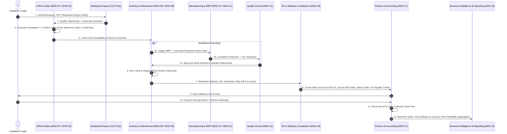

#### Key C2C Architectural Rules:
1. **Dedicated Enquiry Entity:** In strict adherence to BRD requirements, `Enquiry` is maintained as a dedicated first-class business concept in the Customer-to-Cash flow distinct from unstructured Leads and commercial Quotations. Organizational/domain ownership is not asserted beyond what the BRD explicitly establishes and will be finalized during detailed domain design.
2. **Sequential Dispatch Billing:** Outbound goods dispatch creates an inventory valuation impact (Stock in Hand Credit, Cost of Goods Sold / Interim Dispatch Debit). Subsequent Sales Invoice generation books the revenue and statutory tax liability.
3. **Automated Statutory Integration:** Invoice creation invokes Tax & Statutory Compliance (`MOD-18`) to compute CGST, SGST, IGST, validate HSN codes, and prepare signed e-invoice payloads before financial finalization.

### 4.2 Procure-to-Pay (P2P) Flow Architecture

The P2P flow traces the operational expenditure lifecycle from purchase requisition through goods receipt, quality assurance, 3-way matching, and payment disbursement.

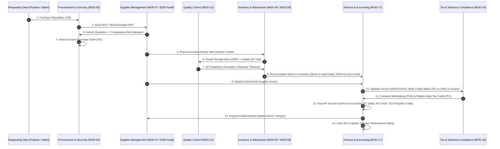

#### Key P2P Architectural Rules:
1. **Unified Supplier Master:** Sourcing, purchasing, quality ratings, and accounts payable interact with a single authoritative Supplier entity (`SF-003` / `SF-004` / `MOD-07`).
2. **Strict 3-Way Matching:** Accounts Payable invoice posting requires automated validation across Purchase Order (authorized prices/terms), Goods Receipt (accepted physical quantities), and Supplier Invoice (billed amounts). Tolerances trigger mandatory workflow escalation (`SF-005`).
3. **GRN Accrual Boundary:** Physical receipt of goods immediately affects inventory valuation, balanced by an interim GRN Clearing Account. The supplier liability is recognized only upon invoice verification.

### 4.3 Asset-to-Service (A2S) Flow Architecture

The A2S flow traces the lifecycle of customer-installed equipment and maintenance operations, maintaining an absolute architectural distinction between Customer Equipment and Corporate Capital Assets.

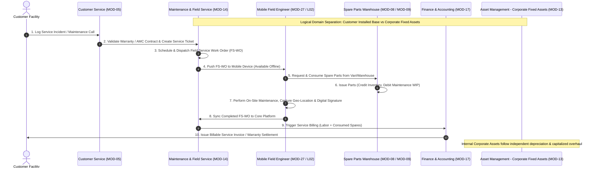

#### Key A2S Architectural Invariants:
1. **Logical Domain Separation:**
   - **Customer Installed Base (`MOD-14`):** External serialized assets owned by customers or operated under lease/AMC. Tracked for warranty, field service history, preventative maintenance schedules, and billable work orders.
   - **Corporate Fixed Assets (`MOD-13`):** Internal capital assets owned by the enterprise. Governed by capitalization thresholds, statutory depreciation schedules (Companies Act / Income Tax), impairment, and disposal accounting.
   - *Persistence Note:* They remain separate authoritative business entities with distinct lifecycle, ownership, and business semantics. They may share underlying persistence infrastructure where architecturally appropriate, without merging domain models.
2. **Work Order Disambiguation:**
   - **Field Service Work Order (FS-WO):** Service execution on customer equipment involving travel, on-site labor hours, diagnostic checklists, and replacement parts (`MOD-14`).
   - **Manufacturing Work Order (MFG-WO):** In-plant assembly or production turning raw materials into finished goods via routing bills of materials (`MOD-10`).

---

## 5. Master Data Architecture & Conceptual Ownership

The platform enforces a single authoritative source of truth for all foundational enterprise entities (`DEC-007`). Duplicate master data stores across modules are strictly prohibited.

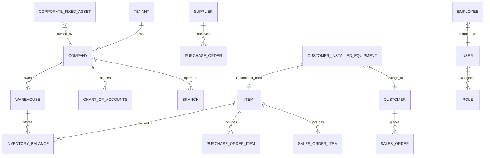

### Master Data Ownership Matrix

| Master Entity | Authoritative Conceptual Owner | Consuming Modules | Lifecycle & Governance Rules |
| :--- | :--- | :--- | :--- |
| **Tenant** | Platform & Administration (`MOD-01` / `SF-001`) | Universal | Highest level of logical data isolation; governs tenant context and subscription entitlements. |
| **Company** | Platform & Administration (`MOD-01` / `SF-001`) | Universal | Legal entity boundary for financial reporting, tax registrations (GSTIN/PAN), and balance sheets. |
| **Branch / Location** | Platform & Administration (`MOD-01` / `SF-001`) | Sales, Procurement, Inventory, Service | Physical or operational subdivision; tracks location-specific inventory, billing, and tax sub-units. |
| **Customer** | CRM & Sales (`MOD-02` / `MOD-03` / `SF-004`) | Sales, Customer Service, E-Commerce, AR | Single customer record across leads, orders, service contracts, and billing. Global credit limits. |
| **Supplier** | Supplier Management (`MOD-07` / `SF-004`) | Procurement, Inventory, Quality, AP | Authoritative vendor profile, statutory tax IDs, bank details, quality rating history, and AP balances. |
| **Item / Product** | Inventory (`MOD-08` / `SF-004`) | Sales, Procurement, Manufacturing, Service | Unified SKU master; encapsulates attributes, HSN codes, UOM conversions, bills of materials, and valuation methods. |
| **Warehouse** | Warehouse (`MOD-09`) | Sales, Procurement, Manufacturing, Service | Hierarchical storage locations; enforces inventory balances, quarantine bins, and valuation posting. |
| **Chart of Accounts** | Finance & Accounting (`MOD-17`) | All Financial Modules | Hierarchical ledger accounts; controls account types, currency restrictions, and financial statement rollups. |
| **Employee** | HR & Payroll (`MOD-19` / `SF-004`) | HR, Approvals, Field Service, Project Mgmt | Authoritative personnel master; links user identity, reporting hierarchy, cost centers, and payroll. |
| **Customer Installed Base** | Maintenance & Field Service (`MOD-14`) | Customer Service, Field Service, Billing | Serialized customer equipment tracking location, warranty terms, service logs, and maintenance contracts. |
| **Corporate Fixed Asset** | Asset Management (`MOD-13`) | Accounting, Maintenance | Enterprise capital equipment tracking asset class, historical cost, accumulated depreciation, and physical tags. |
| **Tax Template & Rules** | Tax & Statutory Compliance (`MOD-18`) | Sales, Purchasing, Accounting | Centralized tax rate, HSN classification, and rule determination matrix across all jurisdictions. |

---

## 6. Transaction Architecture & Business Status Model

### 6.1 Compliance with Approved Decision CD-002

In strict adherence to approved business decision `CD-002`, KIYA 360 decouples operational transactional lifecycles from technical database submission flags (`docstatus`). Operational workflows are governed by explicit **Business Statuses** reflecting real-world commercial milestones.

*Governance Invariant:* The exact universal status names and transition rules are not universally frozen in Phase 1; they are defined progressively by transaction and domain during detailed functional design. The states below are **PROPOSED / ILLUSTRATIVE** of typical operational progression.

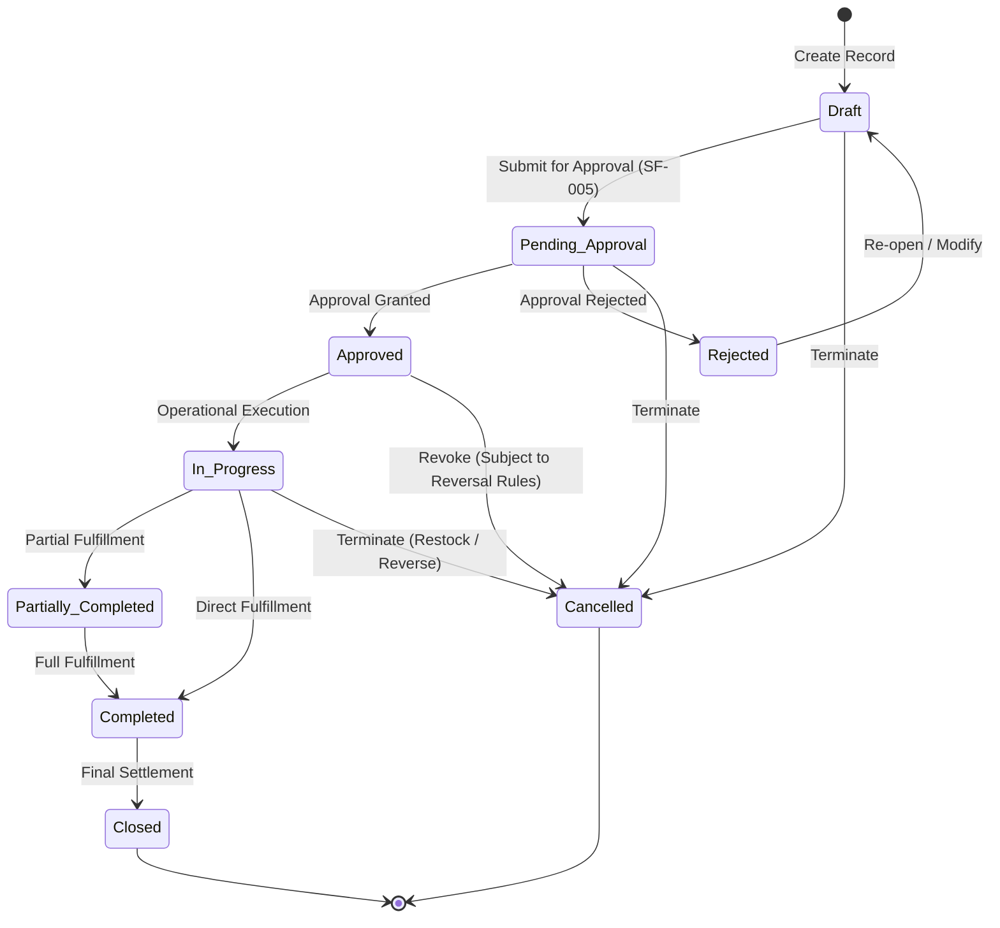

### 6.2 Transaction Rules & Immutability Invariants
1. **Business Status Ownership:** Every operational document (Order, Invoice, Work Order, Dispatch Note) maintains a first-class `business_status` attribute.
2. **Audit Trails:** Every transition between business statuses produces an immutable entry in the audit ledger recording timestamp, user identity, previous status, new status, and approval justification (`SF-008` / `MOD-28`).
3. **Controlled Correction and Reversal (DEC-009):** Posted financial effects and inventory movements are not physically overwritten or deleted. Corrections are performed through controlled adjustments, reversals, or other approved accounting mechanisms while preserving historical auditability.

---

## 7. Financial Integrity Architecture

Financial accounting represents the highest integrity boundary of the platform. Operational modules trigger financial events, but the Finance & Accounting Domain (`MOD-17`) strictly governs ledger posting.

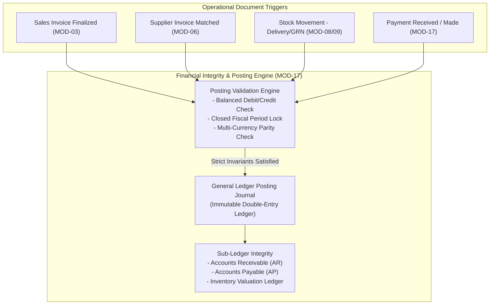

### Core Financial Rules:
1. **Atomic Double-Entry Balancing:** Every GL posting must mathematically balance ($\sum \text{Debits} = \sum \text{Credits}$). Unbalanced postings are rejected at the transaction boundary.
2. **Fiscal Period Governance:** Postings cannot be recorded against closed accounting periods without authorized administrative override, which itself generates an escalated audit log (`SF-008`).
3. **Real-time Inventory Valuation:** Material receipts and dispatches generate perpetual inventory postings ensuring the balance sheet continuously reflects real-time stock value.

---

## 8. Global Tax Engine Architecture (MOD-18)

Tax compliance is a horizontal platform capability housed in Tax & Statutory Compliance (`MOD-18`), serving Sales, Procurement, and Financial Accounting.

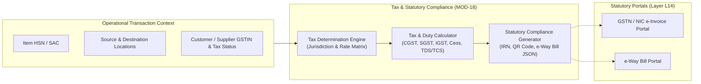

### Core Tax Engine Responsibilities:
1. **Dynamic Tax Determination:** Automatically determines whether a transaction is intrastate (CGST + SGST), interstate (IGST), or export/SEZ based on company registration and point of consumption.
2. **India Statutory Compliance:** Generates standards-compliant e-invoice payloads, validates Invoice Reference Numbers (IRN), embeds signed QR codes into PDF tax invoices, and handles e-way bill generation for dispatches exceeding statutory thresholds.
3. **Decoupled Architecture:** Built as an abstract tax capability so global rules (VAT, Sales Tax) can be supported alongside India GST without rewriting core operational modules. Specific external portal integration and payload validation remain subject to `PoC-02`.

---

## 9. Shared Workflow & Notification Architecture

### 9.1 Shared Workflow Engine (MOD-24 / SF-005)
- **Universal Governance:** A single workflow engine governs approvals across all 28 modules (Sales Orders, POs, Expense Claims, Leaves, Price Overrides).
- **Rule-Based Routing:** Approvals route dynamically based on document attributes (e.g., total monetary value, discount percentage, project code, or branch).
- **Escalation & Delegation:** Configurable SLA timeouts trigger automated reminders or escalate to secondary approvers. Supports temporary delegation during employee absence. Specific threshold matrices remain open under `OQ-003` / `STK-01`.

### 9.2 Shared Multi-Channel Notification Dispatcher (SF-006)
- **Decoupled Delivery:** Operational modules emit high-level notification events (e.g., `OrderConfirmed`, `DispatchCreated`).
- **Channel Adapters:** The notification dispatcher formats localized messages and routes them through configurable channel adapters: Email, SMS, WhatsApp Business API, Mobile Push, and In-App Notifications.
- **Delivery Auditing:** Tracks message status (Queued, Sent, Delivered, Failed, Read) and enforces delivery retries. Trigger/content rules remain open under `OQ-004` / `STK-01`.

---

## 10. Document Management Architecture (DMS) (MOD-21 / SF-007)

- **Centralized Metadata Index:** Universal attachment model allowing files (PDFs, images, technical drawings, inspection certificates) to be linked to any business entity.
- **Physical Decoupling:** Binary file content is stored in secure object storage, completely segregated from transactional relational database tables.
- **Cryptographic Verification:** Files are hashed upon upload (SHA-256) to ensure tamper-evident storage for regulatory and compliance audits.
- **Digital Signatures & Watermarking:** Supports digital signature workflows for commercial contracts and statutory PDF invoice generation.

---

## 11. Tenancy Architecture & Evaluation

In accordance with Phase 1A quality attributes and candidate evaluations, KIYA 360 evaluates three primary tenancy archetypes:

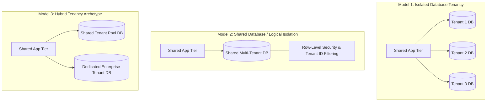

### Tenancy Model Evaluation Summary

| Evaluation Dimension | Model 1: Database-per-Tenant | Model 2: Shared DB with Logical Isolation | Model 3: Hybrid Tenancy Archetype |
| :--- | :--- | :--- | :--- |
| **Data Isolation & Leakage Risk** | **Highest:** Physical database boundary prevents cross-tenant data leaks. | **Moderate:** Relies strictly on application query filters or database Row-Level Security (RLS). | **High:** Dedicated DB for strict enterprise clients; shared pool for standard tiers. |
| **Operational & Migration Complexity** | Moderate: Schema migrations must be executed across $N$ database instances. | Low: Single database migration updates all tenants simultaneously. | Moderate: Dual migration paths for dedicated vs pooled databases. |
| **Backup, Restore & Point-in-Time Recovery** | **Superior:** Individual tenants can be backed up and restored independently. | Complex: Restoring a single tenant requires selective table extract/filter. | **Superior:** Dedicated tenants retain full point-in-time independent recovery. |
| **Resource Efficiency & Infrastructure Cost** | Lower density: Database connection pooling and idle overhead per tenant. | **Highest density:** Optimal connection sharing and infrastructure utilization. | Balanced: Cost-effective for standard tiers, premium pricing for dedicated. |
| **Architectural Status** | **Provisional Leading Candidate (Under Evaluation in PoC-01)** | **Candidate Option (Subject to RLS evaluation)** | **Architectural Option (Long-term enterprise evolution)** |

*Governance Position:* The logical requirement is absolute tenant data isolation (`SF-001`). **Database-per-tenant is a provisional tenancy topology under evaluation**, aligned with Frappe site architecture in `PoC-01`, while maintaining architectural abstraction to enable shared-database or hybrid models if operational review dictates.

---

## 12. Artificial Intelligence Architecture (MOD-25 / SF-010)

AI in KIYA 360 is an **integrated horizontal capability**, governed by strict architectural boundaries to protect transactional and financial integrity.

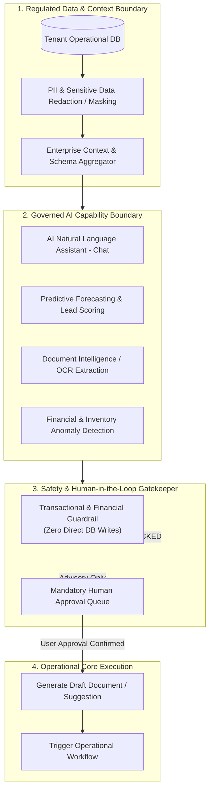

### Invariant AI Safety Principles:
1. **Zero Unassisted Transactional Posting:** AI models are strictly prohibited from directly committing ledger entries, changing inventory balances, or authorizing payments. AI outputs are treated as **unverified suggestions** requiring human review.
2. **Tenant Privacy & Zero Cross-Contamination:** No customer operational data or embeddings may be used to train shared external foundation models. Prompts must be sanitized of sensitive PII before external inference calls.
3. **Model Traceability & Explainability:** Any AI-assisted recommendation (such as lead scoring or fraud alerts) must log the model version, prompt parameters, and confidence score for auditing purposes (`SF-008`). Concrete governance policies remain open under `OQ-014`.

---

## 13. Business Intelligence, Analytics & EPM Architecture (MOD-22 / MOD-23 / SF-011)

To protect operational transactional responsiveness, analytical reporting is decoupled from the primary OLTP path.

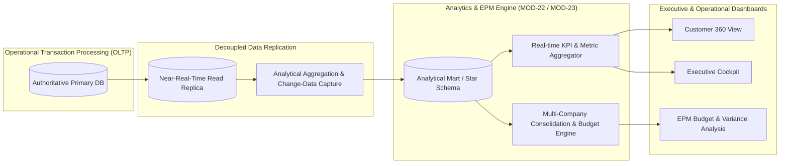

### Core Analytics Principles:
1. **Decoupled Heavy Reporting:** Complex financial consolidations, multi-year trend analyses, and large star-schema aggregations run against read replicas or dedicated analytical marts, preventing locking of operational OLTP tables.
2. **Unified Semantic Metric Layer:** Key enterprise KPIs (e.g., Gross Margin, Days Sales Outstanding, Inventory Turnover, OEE) are defined once in the platform metadata layer to guarantee uniform reporting across all executive dashboards. Specific latency targets remain open under `OQ-015`.

---

## 14. Mobile Architecture & Offline Synchronization (MOD-27 / SF-009)

The mobile architecture supports native-grade field operations (Field Service Engineers, Sales Representatives, Warehouse Pickers) operating in environments with intermittent network connectivity.

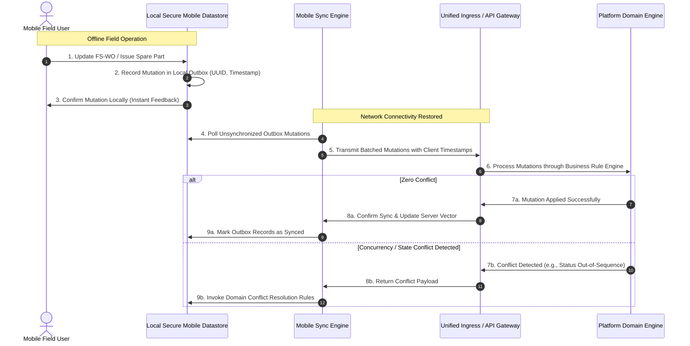

### Invariant Mobile Offline Rules:
1. **Client-Generated UUIDs:** All offline records (Service Logs, Van Stock Adjustments, Notes) are created using client-side UUIDs to prevent primary key collision upon synchronization.
2. **Deterministic Conflict Resolution:** Business rules govern conflicts deterministically (e.g., server-authoritative financial status overrides mobile edits; append-only logs for inspection notes). Specific sync rules remain open under `OQ-013` / `PoC-04`.
3. **Encrypted Local Storage:** Local mobile datastores must enforce hardware-backed encryption to protect customer and commercial data in the event of device loss or theft.

---

## 15. Global Search & Universal Navigation (SF-014)

- **Unified Navigation Paradigm:** The platform provides a single global search bar accessible from all screens to look up documents, master entities, transactions, and navigation menus (`SF-014`).
- **Fast Indexed Lookups:** Key entity identifiers (Order numbers, customer names, serial numbers, phone numbers, GSTINs) are indexed for responsive autocomplete and exact matching.
- **Permission-Filtered Results:** Search results are strictly filtered by user permissions and tenant boundary; users never see records they are not authorized to access.

---

## 16. Target Architecture Quality Attribute Realization

| Quality Attribute | Architectural Mechanism | Verification & Validation Gate |
| :--- | :--- | :--- |
| **Security & Isolation** | Strict tenant boundary enforcement, RBAC/ABAC at API gateway and ORM level, encrypted persistence, immutable audit logging (`SF-008`). | Security audit, penetration testing, tenant data leakage PoC (`PoC-01`). |
| **Financial Integrity** | Atomic double-entry balancing, closed fiscal period locks, immutable reversing entries (`DEC-009`), perpetual inventory valuation. | Automated financial balance testing, reconciliation test suites. |
| **Scalability** | Decoupled background job processing, read replica analytical queries, stateless API services, multi-tenant database partitioning. | High-concurrency performance benchmark (`PoC-03`). |
| **Interoperability** | Standardized JSON REST/RPC APIs, idempotent webhook dispatch, anti-corruption adapters for external statutory portals (`SF-012`). | Mock GSTN / e-way portal integration testing (`PoC-02`). |
| **Resilience & Reliability** | Asynchronous job retries with exponential backoff, circuit-breaking on third-party APIs, transactional two-phase commits. | Fault-injection testing, chaos simulation on background workers. |
| **Maintainability** | Clean separation of 8 strategic seams, decoupled shared foundations, clear module ownership boundaries. | Architecture governance reviews, seam isolation audits. |

---

## 17. Conclusion & Handoff

The Target Architecture (Phase 1C) establishes a comprehensive, evidence-driven foundation for KIYA 360 as a unified business operating platform. It satisfies all functional requirements from Phase 0, honors approved decisions `CD-001` and `CD-002`, enforces strict financial and statutory boundaries, and defines the structural responsibilities required for Phase 1D (Application, API & Integration Architecture).
