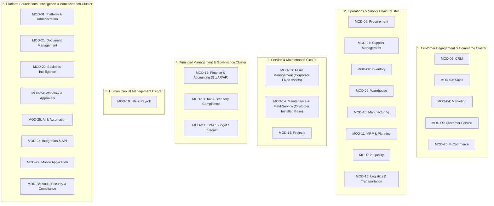
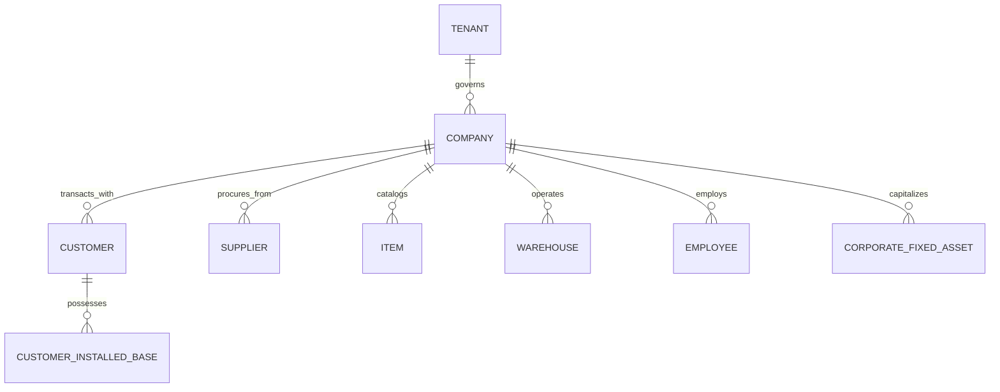
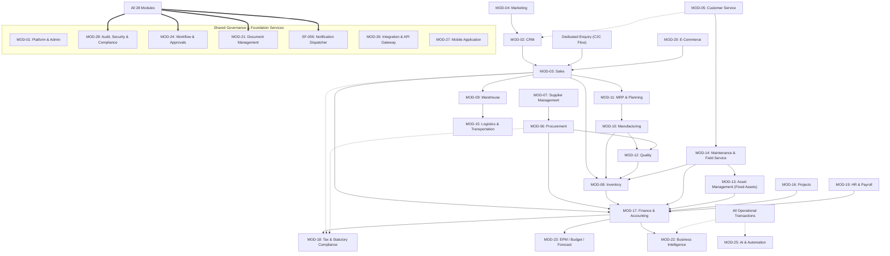

# KIYA 360 — Application, API & Integration Architecture (Phase 1D)

- **Document ID:** `ARCH-05`
- **Phase:** Phase 1D — Application / API / Integration Architecture
- **Status:** `PROVISIONAL BASELINE`
- **Date:** 14 September 2026
- **Authors:** Principal Enterprise Architect, Solution Architect, Integration Architecture Lead
- **Primary Source:** `source/KIYA360_BRD.pdf` (Version 2.0, 13 September 2026)
- **Target Architecture:** `docs/02-architecture/04-target-architecture.md` (Phase 1C)
- **Requirements Traceability:** `docs/00-requirements/` (`01-master-requirements.md` through `36-phase-0-completion-assessment.md`)

---

## 1. Executive Summary & Architectural Scope

This document defines the **Application, API, and Integration Architecture** for KIYA 360. It establishes:
1. The logical application mapping of all **28 authoritative BRD modules** into coherent bounded domains.
2. The authoritative **Module Ownership Matrix**, ensuring every capability has a single unambiguous owner with correct BRD naming and identifiers.
3. The **API & Integration Responsibility Matrix**, defining conceptual interface contracts without premature endpoint fabrication.
4. The authoritative **Master Data Ownership Matrix**, safeguarding enterprise single-source-of-truth invariants (`DEC-007`).
5. The **Cross-Module Dependency Graph** and end-to-end transaction propagation model across C2C, P2P, and A2S.

---

## 2. 28-Module Logical Application Architecture Mapping

In accordance with Phase 1 principles, KIYA 360 is organized into **six logical domain clusters** containing all 28 authoritative BRD modules from `docs/00-requirements/02-module-inventory.md`. This preserves structural modularity while maintaining a unified runtime and persistence core.



---

## 3. Comprehensive Module Ownership Matrix (All 28 Modules)

Every one of the 28 modules defined in the authoritative BRD Module Inventory is mapped below with its primary domain responsibility, dependencies, entity lifecycle, and integration touchpoints.

| Module ID | Authoritative Module Name | Domain Classification | Primary Architectural Responsibility | Shared Foundation Dependencies | Major Upstream Dependencies | Major Downstream Dependencies | Entity Type | AI & Automation Relevance | Current Status |
| :--- | :--- | :--- | :--- | :--- | :--- | :--- | :--- | :--- | :--- |
| **MOD-01** | Platform & Administration | Platform Foundation | Company, branch, business unit masters; user management; system configuration; global settings. | SF-001, SF-002, SF-008, SF-013, SF-014 | Enterprise Directives | Universal across all modules | Master & Governance | Anomaly detection in system access | Baseline Aligned |
| **MOD-02** | CRM | Front-Office Operational | Lead qualification, opportunity scoring, sales pipeline stages, contact tracking. | SF-001, SF-003, SF-004, SF-006, SF-008 | Marketing (MOD-04), Portals | MOD-03 (Sales), MOD-05 (Customer Service) | Master & Operational | Predictive lead scoring, sentiment analysis | Baseline Aligned |
| **MOD-03** | Sales | Core Operational | Quotation generation, Sales Order management, dynamic pricing, discount governance. | SF-001, SF-003, SF-004, SF-005, SF-006, SF-013 | MOD-02 (CRM), MOD-05 (Customer Service) | MOD-08 (Inventory), MOD-11 (MRP), MOD-17 (Finance) | Transactional | Price elasticity recommendations | Baseline Aligned |
| **MOD-04** | Marketing | Front-Office Operational | Campaign management, lead generation, marketing lists, campaign ROI tracking. | SF-001, SF-003, SF-006, SF-008 | Market Channels | MOD-02 (CRM Leads) | Master & Operational | Campaign response propensity models | Baseline Aligned |
| **MOD-05** | Customer Service | Front-Office Operational | Case/ticket management, service desk SLA tracking, customer feedback, knowledge base. (Note: Dedicated Enquiry is represented in the C2C flow; organizational/domain ownership is not asserted beyond the BRD and will be finalized in detailed design). | SF-003, SF-004, SF-006, SF-008, SF-014 | Inbound Channels, Portals | MOD-02 (CRM), MOD-03 (Sales), MOD-14 (Field Service) | Transactional | NLP classification, automated ticket routing | Baseline Aligned |
| **MOD-06** | Procurement | Core Operational | Purchase Requisitions, multi-envelope RFQ/RFP, comparative bid analysis, Purchase Orders. | SF-001, SF-003, SF-004, SF-005, SF-013 | MOD-11 (MRP), MOD-08 (Reorder Min), MOD-16 (Projects) | MOD-08 (GRN), MOD-12 (Quality), MOD-17 (AP) | Transactional | Spend anomaly detection, vendor bid scoring | Baseline Aligned |
| **MOD-07** | Supplier Management | Core Operational | Supplier onboarding, master registry, qualification status, performance scorecards. | SF-001, SF-003, SF-004, SF-008 | Onboarding Portal | MOD-06 (Procurement), MOD-17 (Finance AP) | Master & Analytical | Supplier risk scoring, performance trends | Baseline Aligned |
| **MOD-08** | Inventory | Core Operational | Stock balances, valuation ledger, serial/batch tracking, reorder point triggers, stock transfers. | SF-001, SF-003, SF-004, SF-008, SF-013 | MOD-03 (Sales), MOD-06 (PO), MOD-10 (Shop Floor) | MOD-17 (GL/COGS), MOD-09 (Warehouse), MOD-15 (Logistics) | Master & Transactional | Demand forecasting, stockout prediction | Baseline Aligned |
| **MOD-09** | Warehouse | Core Operational | Multi-facility bin/location tracking, picking, packing, dispatch execution, putaway rules. | SF-001, SF-003, SF-004, SF-008, SF-013 | MOD-03 (Sales Order), MOD-08 (Inventory) | MOD-15 (Logistics Dispatch), MOD-17 (Invoicing) | Transactional | Putaway and picking route optimization | Baseline Aligned |
| **MOD-10** | Manufacturing | Core Operational | Bill of Materials (BOM), routings, work centers, discrete production work orders, shop floor execution. | SF-001, SF-003, SF-004, SF-005, SF-013 | MOD-11 (MRP), MOD-03 (Sales Demand) | MOD-08 (Stock Issue/Receipt), MOD-12 (QC), MOD-17 (Costing)| Master & Transactional | Predictive equipment maintenance, yield optimization | Baseline Aligned |
| **MOD-11** | MRP & Planning | Core Operational | Material requirements planning, master production schedule (MPS), capacity planning, demand forecasting. | SF-001, SF-003, SF-004, SF-008 | MOD-03 (Sales Demand), MOD-08 (Stock) | MOD-06 (Purchase Reqs), MOD-10 (Production Orders) | Analytical & Planning | Demand sensing and forecast optimization | Baseline Aligned |
| **MOD-12** | Quality | Core Operational | Inspection checklists, incoming/in-process/final QC, Non-Conformance (NCR), CAPA workflows. | SF-003, SF-005, SF-007, SF-008 | MOD-06 (GRN), MOD-10 (Production WIP), MOD-08 (Stock) | MOD-08 (Release/Quarantine), MOD-07 (Vendor Rating) | Transactional | Vision-based defect detection (Future evaluation) | Baseline Aligned |
| **MOD-13** | Asset Management | Corporate Support | Corporate fixed asset register, statutory depreciation (SLM/WDV), asset tagging, disposals. | SF-001, SF-003, SF-004, SF-008, SF-013 | MOD-06 (Asset Purchase), Capitalized Overhauls | MOD-17 (Depreciation GL Posting), MOD-14 (Maintenance) | Master & Transactional | Asset residual value prediction | Baseline Aligned |
| **MOD-14** | Maintenance & Field Service | Core Operational | Customer Installed Base tracking, technician dispatch, mobile service orders, spare parts consumption. | SF-001, SF-003, SF-004, SF-005, SF-006, SF-009 | MOD-05 (Customer Service Escalation), AMC Contracts | MOD-08 (Van Stock Issue), MOD-17 (Service Invoice) | Master & Transactional | Dynamic route optimization, failure prediction | Baseline Aligned |
| **MOD-15** | Logistics & Transportation | Operational Support | Vehicle master, driver allocation, route dispatch notes, trip tracking, freight cost tracking. | SF-001, SF-003, SF-004, SF-008, SF-013 | MOD-09 (Warehouse Dispatch), MOD-14 (Field Service Vans) | MOD-17 (Freight Costing), MOD-13 (Vehicle Asset) | Master & Transactional | Dynamic route & fuel efficiency optimization | Baseline Aligned |
| **MOD-16** | Projects | Operational Support | WBS work packages, milestones, project budgeting, resource timesheets, project billing. | SF-001, SF-003, SF-004, SF-005, SF-008, SF-013 | Commercial Contracts, Sales Orders (MOD-03) | MOD-06 (Procurement), MOD-17 (Revenue Recognition) | Transactional | Schedule slippage prediction | Baseline Aligned |
| **MOD-17** | Finance & Accounting | Core Governance | Double-entry GL, AR, AP, cost centers, bank reconciliation, fiscal close, financial reporting. | SF-001, SF-003, SF-004, SF-008, SF-013 | MOD-03 (Sales Inv), MOD-06 (AP Inv), MOD-08 (COGS), MOD-19 (Payroll) | MOD-22 (BI), MOD-23 (EPM Consolidation) | Transactional & Master | Ledger anomaly detection, cash flow forecasting | Baseline Aligned |
| **MOD-18** | Tax & Statutory Compliance | Core Governance | Global tax engine, India GST determination, e-invoicing (IRN), e-way bills, statutory tax filings. | SF-001, SF-003, SF-008, SF-012 | MOD-03 (Sales Invoicing), MOD-06 (Purchase Invoicing) | MOD-17 (Tax GL Posting), Statutory Portals | Governance & Engine | Tax discrepancy detection, reconciliation | Baseline Aligned |
| **MOD-19** | HR & Payroll | Corporate Support | Employee master, org structure, attendance, leaves, payroll processing, statutory deductions (PF/ESI/TDS).| SF-001, SF-002, SF-003, SF-004, SF-005, SF-008 | Corporate Directives, Time Logs | MOD-17 (Payroll GL Journal), Bank Rails | Master & Transactional | Attrition risk scoring, payroll anomaly detection | Baseline Aligned |
| **MOD-20** | E-Commerce | Channel Experience | B2B/B2C product catalog, customer self-service, digital cart, online order placement, statement downloads. | SF-001, SF-003, SF-004, SF-012 | MOD-03 (Catalog/Pricing), MOD-08 (Stock Availability) | MOD-03 (Sales Orders), MOD-17 (Payment Rails) | Channel & Transactional | Product recommendation engine, churn mitigation | Baseline Aligned |
| **MOD-21** | Document Management | Platform Foundation | Universal document storage, entity linking, versioning, cryptographic hashing (SHA-256), digital signatures. | SF-001, SF-007, SF-008 | Universal across all 27 modules | Secure Object Storage Persistence | Foundation Service | Automated document OCR, intelligent tagging | Baseline Aligned |
| **MOD-22** | Business Intelligence | Intelligence & Analytics | Multi-dimensional reports, operational dashboards, KPI scorecards, drill-down analytics. | SF-001, SF-003, SF-011 | All Operational & Financial Modules | Executive & Operational Presentation | Analytical Read Model | Automated business insight narratives | Baseline Aligned |
| **MOD-23** | EPM / Budget / Forecast | Intelligence & Analytics | Multi-entity financial consolidation, strategic planning, rolling forecasts, what-if modeling, budget control.| SF-001, SF-003, SF-008, SF-011 | MOD-17 (GL Balances), Strategic Directives | Board & Executive Reporting | Analytical Model | Automated variance driver explanation | Baseline Aligned |
| **MOD-24** | Workflow & Approvals | Platform Foundation | Universal approval engine, dynamic threshold routing, SLA escalation, multi-level authorizations, delegation. | SF-001, SF-002, SF-005, SF-006, SF-008 | Universal across all 27 modules | Operational Status Transitions across all modules | Foundation Service | Bottleneck prediction, smart routing | Baseline Aligned |
| **MOD-25** | AI & Automation | Platform Intelligence | Centralized LLM/ML gateway, prompt governance, model versioning, task automation agents. | SF-001, SF-008, SF-010 | Universal Platform Data | Assistive Drafts across all Modules | Horizontal Platform Tier | Universal generative & predictive models | Baseline Aligned |
| **MOD-26** | Integration & API | Platform Foundation | Unified Ingress / API Gateway, rate limiting, authentication termination, webhook management, adapters. | SF-001, SF-002, SF-008, SF-012 | External Systems, Client Applications | Core Platform Ingress | Ingress & Gateway | Threat detection, traffic pattern anomaly alerts | Baseline Aligned |
| **MOD-27** | Mobile Application | Channel Experience | Native-grade mobile client, offline-first data cache, background synchronization, barcode/QR capture. | SF-001, SF-002, SF-008, SF-009, SF-012 | Core Platform APIs | Field Mobility across Sales, Service, Warehouse | Client & Channel | On-device lightweight inference | Baseline Aligned |
| **MOD-28** | Audit, Security & Compliance | Platform Foundation | Immutable audit ledger (`SF-008`), RBAC/ABAC role authoring, session governance, compliance inspection. | SF-001, SF-002, SF-008 | Universal across all 27 modules | Universal Security Enforcement | Governance & Foundation | Security log analysis, intrusion detection | Baseline Aligned |

---

## 4. API & Integration Responsibility Matrix

The integration architecture establishes clear, governed contracts between platform capabilities without premature hardcoding of concrete URL paths.

```mermaid
graph LR
    subgraph Inbound["Inbound Integration Contracts"]
        Webhooks["Inbound Webhooks (Payment, Couriers)"]
        ClientApps["Client Applications (Web / Mobile)"]
        ExtB2B["B2B Partner Integrations (EDI / API)"]
    end

    subgraph IngressGateway["Strategic Seam: Unified Ingress & API Gateway (MOD-26 / SF-012)"]
        AuthZ["AuthN / AuthZ Enforcement (SF-002)"]
        RateLimit["Tenant Quotas & Rate Limiting"]
        Idempotency["Idempotency Key Verification"]
        AuditLog["Ingress Audit Ledger (SF-008)"]
    end

    subgraph InternalServices["Core Application Domains"]
        SalesDomain["Sales & Order Service (MOD-03)"]
        InventoryDomain["Inventory & Logistics Service (MOD-08/09)"]
        FinanceDomain["Financial Posting Service (MOD-17)"]
    end

    subgraph Outbound["Outbound Integration Adapters"]
        GSTN["India GSTN / e-Invoice Portal (MOD-18)"]
        BankAPI["Banking & Payment Rails (MOD-17)"]
        NotifGW["SMS / WhatsApp / Email Gateways (SF-006)"]
    end

    Inbound --> IngressGateway
    IngressGateway --> InternalServices
    InternalServices --> Outbound
```



| Business Capability | Exposed Interface Responsibility | Consuming Capability | Producer / Owner Domain | Data Entities Involved | Processing Model | Security & Isolation Concern | Audit & Traceability Concern | Current Status |
| :--- | :--- | :--- | :--- | :--- | :--- | :--- | :--- | :--- |
| **Order Placement** | Validate commercial terms, reserve inventory, create Sales Order. | E-Commerce (`MOD-20`), Sales UI (`MOD-03`) | Sales (`MOD-03`) | Customer, Item, Pricing, Sales Order | Synchronous Transaction | Tenant boundary check, customer credit limit check. | Immutable audit log of order creation and price overrides (`SF-008`). | Baseline Aligned |
| **Inventory Availability** | Query real-time available-to-promise (ATP) stock balances across facilities. | Sales Order (`MOD-03`), E-Commerce (`MOD-20`) | Inventory (`MOD-08`) | Item, Facility, Bin, Reserved Stock | Synchronous Read | Read-only access filtered by authorized company/branch. | High-frequency query; logged only on reservation mutation. | Baseline Aligned |
| **Material Dispatch** | Record physical goods issue, generate picking list and outbound delivery note. | Warehouse Operations (`MOD-09`), Logistics (`MOD-15`) | Warehouse (`MOD-09`) | Sales Order, Dispatch Note, Serial/Batch Tags | Synchronous Transaction | Warehouse facility authorization, picker role verification. | Batch/serial movement log linked to dispatch note. | Baseline Aligned |
| **Statutory Tax Determination** | Calculate transaction taxes (GST/VAT/TDS) and prepare statutory e-invoice payloads. | Sales Invoicing (`MOD-03`), Purchase Invoicing (`MOD-06`) | Tax & Statutory Compliance (`MOD-18`) | Line Items, HSN/SAC, Source/Dest GSTIN | Synchronous Transaction | Encrypted transmission; verification of digital signatures. | Complete payload and response hash logged in tax audit table. | Baseline Aligned |
| **GL Journal Entry Posting** | Validate double-entry debits/credits and post balanced financial journals. | Invoicing, Payments, Inventory Valuation, Payroll | Finance & Accounting (`MOD-17`) | GL Accounts, Cost Centers, Amounts, Currency | Synchronous Atomic Transaction | Strict separation of duties; closed fiscal period lock. | Permanent, non-deletable journal record with sequential voucher ID (`SF-013`). | Baseline Aligned |
| **3-Way PO Match** | Cross-validate Purchase Order, Goods Receipt, and Supplier Invoice amounts. | Accounts Payable (`MOD-17`) | Procurement (`MOD-06`) / AP (`MOD-17`) | PO, GRN, Supplier Invoice | Synchronous Transaction | Vendor balance verification, approval authorization limits. | Discrepancy logs and automated escalation triggers (`SF-005`). | Baseline Aligned |
| **Field Work Order Sync** | Ingest offline field service updates, hours, parts consumption, and client signatures. | Mobile App (`MOD-27` / `L02`) | Maintenance & Field Service (`MOD-14`) | Work Order, Technician UUID, Parts, Signature | Asynchronous Idempotent Batch | Device token authentication, cryptographic signature payload. | Mutation timeline reconstructed using client & server timestamps. | Baseline Aligned |
| **Notification Event Dispatch** | Ingest domain business events and distribute multi-channel alerts. | Universal Domain Triggers | Notification Dispatcher (`SF-006`) | Recipient, Channel, Template ID, Variables | Asynchronous Queued | PII protection, secure token handling for external gateways. | Delivery status audit (Sent, Delivered, Failed) per recipient. | Baseline Aligned |
| **Bank Statement Reconcile** | Ingest electronic bank feeds and execute automated reconciliation against GL. | Bank APIs, Treasury Portal | Finance & Accounting (`MOD-17`) | Bank Transactions, Payment Vouchers | Asynchronous / Batch | Bank-grade encrypted channel, mutual TLS or signed tokens. | Reconciliation audit log tracking matched and unmatched items. | Baseline Aligned |
| **Document Archival** | Ingest binary documents, compute SHA-256 hashes, and link to parent business entity. | Universal Entity Attachments | Document Management (`MOD-21` / `SF-007`)| File Binary, Metadata, Parent Entity UUID | Synchronous Upload / Async Processing | Strict permission inheritance from parent business document. | Immutable cryptographic hash and access log (`SF-008`). | Baseline Aligned |

---

## 5. Master Data Ownership & Single Source of Truth Matrix

To guarantee strict compliance with the **Single Source of Truth Check**, master data entities are authoritatively owned by exactly one domain, while being uniformly referenced across the platform (`DEC-007`).



| Master Entity | Authoritative Conceptual Owner | Consuming Modules / Domains | Authoritative Primary Datastore | Derived / Read Replica Views | Data Sensitivity Class | Audit Importance | Lifecycle Governance & Invariants |
| :--- | :--- | :--- | :--- | :--- | :--- | :--- | :--- |
| **Customer** | CRM (`MOD-02`) / Sales (`MOD-03`) | Sales, Customer Service, E-Commerce, AR, Field Service | Primary Relational DB (Tenant Site) | Customer 360 Mart, Search Index, Mobile Local DB | Commercial Confidential / PII | **Critical:** Financial & Credit Limit Changes | Unique statutory tax ID (GSTIN/PAN); single master record across leads, orders, and billing. Global credit limit enforcement. |
| **Supplier** | Supplier Management (`MOD-07`) | Procurement, Inventory, Quality, AP, Asset Management | Primary Relational DB (Tenant Site) | Supplier Performance Mart, AP Sub-Ledger | Commercial Confidential / Banking PII | **Critical:** Bank Details & Tax Status Changes | Verified bank account details; statutory GSTIN validation; performance scoring updated from inspection notes and delivery timings. |
| **Item / Product** | Inventory (`MOD-08`) | Sales, Procurement, Manufacturing, Quality, Service | Primary Relational DB (Tenant Site) | E-Commerce Catalog, Price Books, Mobile Van Inventory | Proprietary / Commercial | **High:** HSN Code, Costing & Valuation Edits | SKU uniqueness; immutable valuation method (FIFO/Moving Average); mandatory HSN/SAC code assignment for tax determination. |
| **Warehouse / Facility** | Warehouse (`MOD-09`) | Sales, Purchasing, Manufacturing, Field Service | Primary Relational DB (Tenant Site) | Bin Allocation Cache, Dispatch Lookups | Operational Confidential | **High:** Facility Creation & Deactivation | Physical and virtual bins; company ownership; enforces perpetual inventory tracking; cannot be deleted if active stock exists. |
| **Customer Installed Base** | Maintenance & Field Service (`MOD-14`) | Customer Service, Field Service, Warranty Invoicing | Primary Relational DB (Tenant Site) | Technician Mobile Store, Service History Mart | Operational / Customer Data | **High:** Serial Number & Warranty Changes | Serialized customer equipment; warranty expiration tracking; distinct from corporate assets; tracks maintenance work orders. |
| **Corporate Fixed Asset** | Asset Management (`MOD-13`) | Finance, Maintenance, Corporate Tax | Primary Relational DB (Tenant Site) | Balance Sheet Asset Schedules, Tax Books | Financial Confidential | **Critical:** Capitalization, Depreciation & Disposal | Internal capital asset; statutory depreciation calculation (Companies Act / Tax); capitalized improvements; distinct from customer equipment. |
| **Chart of Accounts** | Finance & Accounting (`MOD-17`) | Universal across all financial & operational modules | Primary Relational DB (Tenant Site) | Financial Statements, EPM Consolidation Mart | Strictly Financial Confidential | **Maximum:** Account Creation, Hierarchy & Locks | Standardized accounting hierarchy; parent-child rollups; currency locks; cannot be deactivated if non-zero ledger balance exists. |
| **Employee** | HR & Payroll (`MOD-19`) | HR, Payroll, Project Timesheets, Approvals, Users | Primary Relational DB (Tenant Site) | Org Hierarchy Cache, Approver Directory | Strictly PII / Confidential | **Critical:** Salary, Role & Status Modifications | Authoritative personnel profile; links system user identity, reporting manager, departmental cost center, and payroll structure. |
| **Company** | Platform & Administration (`MOD-01`) | Universal across all modules | Primary Relational DB (Tenant Site) | Corporate Reporting Views | Legal Entity Master | **Critical:** Registration & Legal Entity Updates | Legal corporate entity; owns Chart of Accounts; defines statutory tax registrations, base currency, and fiscal year calendar. |
| **Branch / Sub-Unit** | Platform & Administration (`MOD-01`) | Sales, Procurement, Warehouse, Operations | Primary Relational DB (Tenant Site) | Operational Routing Rules | Operational Master | **High:** Location Configuration | Operational subdivision of a company; tracks state-specific GSTIN registrations, local warehouses, and regional operations. |
| **Tax Rule & Matrix** | Tax & Statutory Compliance (`MOD-18`) | Sales, Procurement, Accounting, E-Commerce | Primary Relational DB (Tenant Site) | Fast Tax Resolution Cache | Regulatory / Compliance | **Critical:** Rate & Eligibility Amendments | Authoritative tax determination rules; versioned effective date ranges; links HSN/SAC codes with statutory duty percentages. |
| **Currency & Exchange Rates**| Platform & Admin (`MOD-01`) / Finance (`MOD-17`)| Sales, Procurement, Accounting, EPM | Primary Relational DB (Tenant Site) | Multi-Currency Conversion Engine | Financial Reference | **High:** Daily Rate Book Updates | Base currency defined at Company level; daily spot and monthly average exchange rate tables with effective timestamps. |
| **Unit of Measure (UOM)** | Inventory (`MOD-08`) | Sales, Procurement, Manufacturing, Warehouse | Primary Relational DB (Tenant Site) | UOM Conversion Cache | Operational Reference | **Moderate:** Conversion Factor Edits | Standardized measurement units (Kg, Meter, Piece); precision decimal limits; validated conversion multipliers per SKU. |
| **User & Security Role** | Audit, Security & Compliance (`MOD-28`)| Universal across all modules | Primary Relational DB (Tenant Site) | Permission Evaluation Cache | Security Sensitive | **Maximum:** Role Assignment & Credential Changes | System identity mapped to Employee or External Contact; RBAC role bindings; session tokens; two-factor authentication flags. |

---

## 6. Cross-Module Dependency Graph

The following graph documents the structural, operational, and governance dependencies across the platform using the authoritative module identifiers.



---

## 7. Event & Transaction Propagation Architecture

Cross-module transaction propagation adheres to strict architectural boundaries: **Authoritative Source-of-Truth Data**, **Derived Read Models**, **Operational Business Events**, and **Financial Posting Invariants**.

```
[Operational Event Progression: Customer-to-Cash Traceability]

1. Sales Order Confirmed (MOD-03)
   ├── Source Data Created: Sales Order Record (Status: Confirmed)
   ├── Inventory Effect: Allocates ATP Quantity (MOD-08) [Derived Allocation]
   ├── Planning Effect: Generates MRP Gross Demand (MOD-11)
   └── Audit & Event: SOConfirmedEvent emitted to Workflow & Audit (MOD-28 / SF-008)

2. Inventory Dispatch Executed (MOD-08 / MOD-09)
   ├── Source Data Created: Dispatch Note & Picking Slip (MOD-09)
   ├── Physical Inventory Effect: Decrements Physical Bin Stock (MOD-08)
   ├── Financial Posting: Debit Interim Dispatch / COGS, Credit Inventory (MOD-17)
   └── Logistics Effect: Triggers Vehicle Trip Allocation (MOD-15)

3. Sales Invoice Finalized (MOD-17 / MOD-18)
   ├── Statutory Compliance: Computes Taxes, Generates IRN & e-Way Bill via Tax Engine (MOD-18)
   ├── Financial Posting: Debit Accounts Receivable, Credit Revenue, Credit Tax Payable (MOD-17)
   └── Sub-Ledger Effect: Opens Customer AR Ledger Item

4. Customer Payment Settled (MOD-17)
   ├── Financial Posting: Debit Bank Account, Credit Accounts Receivable (MOD-17)
   ├── Sub-Ledger Effect: Reconciles & Clears Customer AR Open Item
   └── Analytics Effect: Updates Customer DSO & Real-Time Gross Margin in BI (MOD-22)
```

### Event Propagation Boundary Rules:
1. **No Distributed Two-Phase Commits Across External Boundaries:** All intra-platform transactional mutations (e.g., Sales Order creation and Stock Reservation) occur within the transactional boundaries of the core persistence tier.
2. **Asynchronous Non-Critical Propagation:** Non-blocking operations (such as notification dispatch via `SF-006`, analytical index updates, search indexing via `SF-014`, and customer portal webhooks) are executed asynchronously via decoupled background workers.
3. **Financial Isolation Invariant:** Operational events *never* bypass the Financial Validation Engine. An inventory movement or commercial billing event must post to the General Ledger through the validated double-entry posting journal in Finance & Accounting (`MOD-17`).

---

## 8. Conclusion & Handoff

The Application, API, and Integration Architecture (Phase 1D) establishes comprehensive domain boundaries, authoritative single-source-of-truth ownership, and robust transaction propagation rules across all 28 authoritative BRD modules. It directly enables Phase 1E (Deployment & Operations Architecture) to package and host these capabilities securely and scalably.
