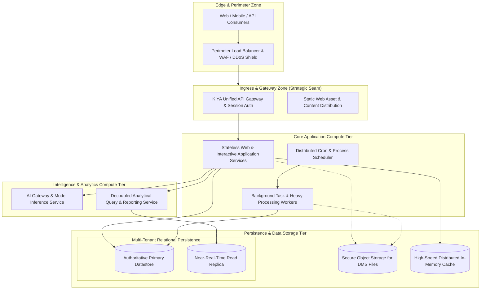
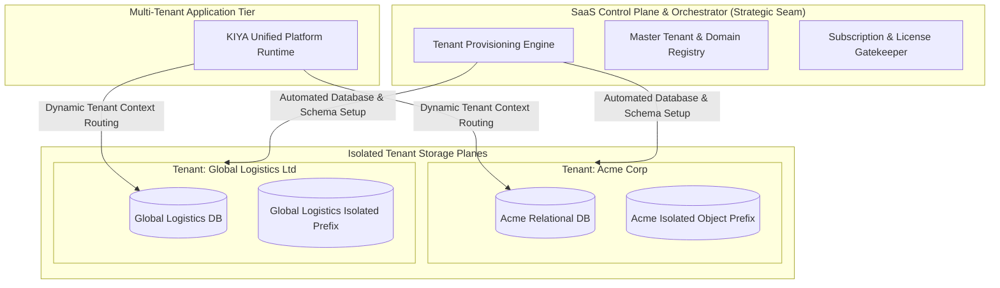
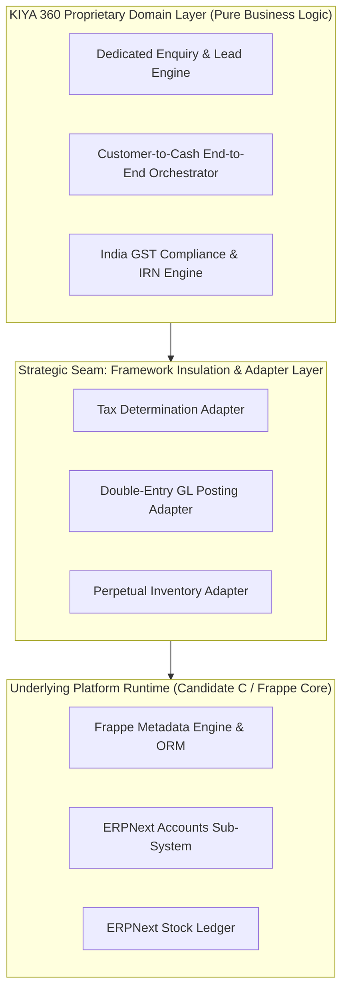

# KIYA 360 — Deployment & Operations Architecture (Phase 1E)

- **Document ID:** `ARCH-06`
- **Phase:** Phase 1E — Deployment / Operations Architecture
- **Status:** `PROVISIONAL BASELINE`
- **Date:** 14 September 2026
- **Authors:** Principal Enterprise Architect, Solution Architect, Platform Operations Lead
- **Primary Source:** `source/KIYA360_BRD.pdf` (Version 2.0, 13 September 2026)
- **Target Architecture:** `docs/02-architecture/04-target-architecture.md` (Phase 1C)
- **Application Architecture:** `docs/02-architecture/05-application-api-integration-architecture.md` (Phase 1D)

---

## 1. Executive Summary & Operational Scope

This document defines the **Deployment and Operations Architecture** for KIYA 360. It translates the logical and application designs into an enterprise-ready operational model, governing:
1. Conceptual **Deployment Environments** and promotion pipelines across the software development lifecycle.
2. Conceptual **Runtime Topologies**, compute zoning, and multi-tenant isolation architectures.
3. Asynchronous **Background Job Processing and Distributed Scheduling**.
4. **Resilience, High Availability, Backup, and Disaster Recovery** models.
5. **Observability, Health Telemetry, and Operational Governance**.
6. **Extensibility, Isolation Seams, and Decoupled Upgradability** to prevent framework lock-in.

*Architectural Boundary Rule:* In accordance with Phase 1 governance, this document defines architectural responsibilities, isolation boundaries, and operational patterns. It intentionally defers premature commercial commitments to specific cloud hyperscalers (AWS/Azure/GCP), container orchestration engines, or proprietary monitoring vendors until Phase 2 operational validation.

---

## 2. Conceptual Deployment Environments & Lifecycle Pipeline

The platform establishes four strictly segregated deployment environments to guarantee software quality, data isolation, and regulatory compliance.

```mermaid
graph LR
    subgraph DevEnv["1. Development (DEV)"]
        DevCode["Feature Engineering & Unit Tests"]
        MockData["Synthetic Mock Datasets"]
    end

    subgraph TestEnv["2. System Integration & QA (TEST)"]
        AutomatedQA["Automated Regression & API Suites"]
        PoCTesting["PoC Validation (India Tax, Multi-Tenant)"]
    end

    subgraph StagingEnv["3. Staging & User Acceptance (UAT)"]
        UATTesting["End-to-End Business Flow Validation"]
        PreProdLoad["Pre-Production Migration Drills"]
    end

    subgraph ProdEnv["4. Production (PROD)"]
        LiveTenants["Live Multi-Tenant SaaS Engine"]
        StatutoryComms["Live GSTN & Banking Gateway Rails"]
    end

    DevEnv -->|Automated Merge Build| TestEnv
    TestEnv -->|Quality Gate Passed| StagingEnv
    StagingEnv -->|Human Sign-off & Audit| ProdEnv
```

### Environment Governance Matrix

| Environment | Purpose & Scope | Data Classification & Policy | Ingress & Access Policy | Configuration & Secrets Management |
| :--- | :--- | :--- | :--- | :--- |
| **Development (DEV)** | Developer sandbox, feature branch validation, rapid prototyping. | Strictly synthetic mock data. Zero production customer data permitted. | Restricted to engineering team via internal development credentials. | Local environment variables; ephemeral development secrets. |
| **System Integration (TEST)** | Cross-module integration testing, automated regression, API contract validation, PoC drills. | Anonymized test fixtures and synthetic multi-company datasets. | Automated CI/CD runner access; restricted QA engineering access. | Centrally managed test secrets; automated deployment pipelines. |
| **Staging / UAT (STAGE)** | Customer acceptance testing, performance benchmarking, release dress rehearsals, statutory drills. | High-fidelity sanitized data or approved pre-production tenant instances. | Authorized enterprise client reviewers, QA leads, and solution architects. | Production-equivalent secrets management; strictly isolated from live credentials. |
| **Production (PROD)** | Authoritative live commercial operations for enterprise tenants. | Live, confidential enterprise master and transactional datasets. | Public ingress strictly via API Gateway & WAF; role-governed MFA for administration. | Secure enterprise vault/secrets manager; audited access; zero plain-text secrets in repos. |

---

## 3. Conceptual Runtime Topology & Compute Zoning

The deployment architecture segregates compute and storage workloads into distinct operational zones, ensuring security, resilience, and horizontal elasticity.

### Compute Tier Responsibilities:
1. **Perimeter Load Balancing Tier:** Terminates transport security, inspects ingress traffic for common vulnerabilities, and routes requests to the API Gateway.
2. **Stateless Web Application Tier:** Handles interactive user sessions, parses requests, evaluates business rules, and serves UI assets. Operates completely statelessly to enable horizontal auto-scaling based on user concurrency.
3. **Dedicated Background Worker Tier:** Offloads long-running and asynchronous tasks (e.g., PDF generation, bulk email dispatch, statutory invoice JSON building, MRP recalculations) to dedicated compute pools, preventing degradation of interactive UI response times.
4. **Analytical & Intelligence Tier:** Houses the decoupled BI/EPM query engines and AI proxy workers, guaranteeing that analytical aggregation queries run against read replicas rather than the primary transactional database.
5. **Persistence Tier:** Authoritative relational databases configured in high-availability clusters with automated failover and continuous point-in-time recovery.

---

## 4. Tenant Lifecycle & Operational Isolation Topology

In alignment with Phase 1C evaluation, KIYA 360 supports the **Isolated Site / Database-per-Tenant model** as its primary operational archetype, while supporting logical tenancy abstraction.

### Tenant Lifecycle Operations:
- **Tenant Provisioning:** The SaaS Control Plane automates new tenant setup: allocates a database instance, applies the baseline database schema, creates the initial administrative account, seeds standard reference data (UOMs, standard tax templates), and generates an isolated file storage bucket.
- **Tenant Migration & Upgrade:** Tenant databases are migrated sequentially through automated migration scripts, enabling phased, blue/green canary upgrades across tenant cohorts.
- **Tenant Backup & Isolation:** Backups are executed on a per-tenant database level, guaranteeing that a restore drill for Tenant A has zero operational impact on Tenant B.

---

## 5. Background Workload & Distributed Scheduler Architecture

Background operations represent a major pillar of enterprise ERP execution. Workloads are categorized and governed to ensure processing reliability.

| Workload Category | Typical Platform Tasks | Execution Model | Priority Tier | Retry & Error Policy |
| :--- | :--- | :--- | :--- | :--- |
| **Statutory & Regulatory** | India GST e-Invoice generation, e-Way bill synchronization, IRN payload signing. | Event-Driven Asynchronous | **Critical (P0)** | Exponential backoff (1s, 5s, 30s); failure alerts trigger immediate admin review. |
| **Transactional Documents** | Purchase Order PDF rendering, Sales Invoice PDF generation, digital signing. | Event-Driven Asynchronous | **High (P1)** | 3 immediate retries; dead-letter queue with dashboard visibility. |
| **Notification Dispatch** | Customer order confirmation emails, WhatsApp dispatch, SMS alerts. | Queued Asynchronous | **Standard (P2)** | Provider retry policy; failures logged without blocking business transactions. |
| **Analytical & EPM Sync** | Read-replica aggregation, BI star-schema refreshing, EPM budget variance rollups. | Scheduled Off-Peak Batch | **Low (P3)** | Skipped iterations logged; rescheduled for subsequent cycle. |
| **System Maintenance** | Database index maintenance, expired session cleanup, audit log archiving. | Scheduled Low-Traffic Window | **Maintenance (P4)** | Monitored by operational runbooks; auto-alert on timeout. |

---

## 6. Resilience, High Availability & Disaster Recovery

The platform enforces systematic resilience patterns across all operational layers:

### 6.1 Fault Isolation & Circuit Breaking
- **External Gateway Decoupling:** Interactions with external statutory portals (GSTN/NIC), banking rails, and messaging aggregators are protected by circuit breakers and rate limiters. If an external service experiences an outage, KIYA 360 queues outbound requests gracefully and presents clear operational statuses to users rather than crashing interactive sessions.
- **Idempotency Enforcement:** All inbound state-changing requests (such as invoice approvals, payment confirmations, and offline mobile sync batches) require a unique client-generated Idempotency Key. Duplicate submissions return the existing result without executing redundant ledger or inventory postings.

### 6.2 High Availability & Disaster Recovery Strategy
- **Active-Passive Database Failover:** The authoritative relational datastore maintains a synchronous hot standby. In the event of primary hardware failure, automated failover promotes the standby instance.
- **Continuous Point-in-Time Recovery (PITR):** Write-Ahead Logging (WAL) / transaction logs are continuously streamed to durable, multi-region object storage, enabling granular recovery to any second preceding an operational incident.
- **Disaster Recovery (DR) Drills:** Documented operational runbooks govern cross-region restoration of the SaaS Control Plane, tenant registries, and tenant databases.

---

## 7. Operational Observability & Telemetry Architecture

The platform architecture mandates structured telemetry emission across all 14 conceptual layers.

```mermaid
graph LR
    subgraph TelemetrySources["Distributed Telemetry Sources"]
        APILogs["API Gateway Access & Security Logs"]
        AppTraces["Domain Service Distributed Traces"]
        WorkerMetrics["Background Job Queue & Latency Metrics"]
        DBMetrics["Database Connection & Query Metrics"]
    end

    subgraph ObservabilityCollector["Unified Telemetry Collector & Pipeline"]
        LogAggregator["Structured Log Ingestion (JSON Format)"]
        TraceCollector["Distributed Context Correlator (Trace ID)"]
        MetricsEngine["Time-Series Metric Aggregator"]
    end

    subgraph OperationsConsole["Operational Dashboard & Alerting"]
        HealthDash["System Health & SLA Cockpit"]
        AlertRouter["Pager / On-Call Incident Dispatcher"]
        AuditViewer["Compliance & Security Audit Explorer"]
    end

    TelemetrySources --> ObservabilityCollector
    ObservabilityCollector --> OperationsConsole
```

### Telemetry Standards:
1. **Universal Correlation ID:** Every inbound user or API request is assigned a unique `X-Correlation-ID` at the API Gateway, which propagates through application domain services, background workers, and database query annotations.
2. **Structured Log Format:** All application and system logs are emitted in standardized JSON format containing timestamp, tenant ID, user ID, module ID, log level, correlation ID, and message.
3. **Separation of Operational Logs vs. Compliance Audit:** Operational logs (debug/info/warn) are managed with lifecycle expiration. In contrast, the **Audit Ledger (`SF-010`)** is an immutable, non-deletable business compliance record stored in dedicated tables.

---

## 8. Customization, Extensibility & Framework Coupling Insulation

A paramount architectural imperative for KIYA 360 is avoiding unmaintainable, tight coupling to underlying frameworks (such as ERPNext or Frappe).

### Principles of Framework Insulation:
1. **Anti-Corruption Adapters:** Proprietary KIYA business domains (such as Enquiry Management, Field Service Orchestration, and India Tax E-Invoicing) communicate with underlying ERPNext/Frappe components exclusively through formal adapters.
2. **Preservation of Upstream Upgradeability:** Core ERPNext / Frappe source code is **never modified directly**. All extensions, hooks, and custom behaviors are implemented in isolated KIYA custom applications, ensuring seamless application of upstream security patches.
3. **Reversibility of Selective Reuse:** If future operational or licensing requirements necessitate replacing an ERPNext component (e.g., migrating from ERPNext Accounts to a custom clean-room double-entry ledger), only the specific adapter implementation needs to be rewritten, leaving front-end UI and cross-module business flows completely intact.

---

## 9. Conclusion & Handoff

The Deployment and Operations Architecture (Phase 1E) provides a comprehensive operational blueprint for hosting, scaling, securing, and maintaining KIYA 360. It enforces rigorous environment segregation, guarantees tenant isolation, defines resilient background processing, and establishes an anti-corruption layer to safeguard KIYA's intellectual property and architectural reversibility. This completes the core architecture specification suite, clearing the path for the Phase 1 Governance Registers and Final Seal.
