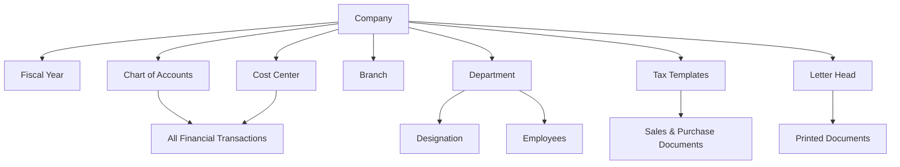

# 🏢 ERPNext — Organization Module: Complete Guide

---

## 🟢 What is the Organization Module?

Think of ERPNext like the **brain of your entire business**. Before the brain can do anything — process sales, pay employees, buy materials — it needs to **know who it is working for**.

The **Organization Module** (also called **"Company Setup"** or the **"Accounting & Organization"** foundation) is the very first thing you configure. It is where you tell ERPNext:

> *"Hey! Here is who we are, where we operate, what currency we use, and how we are structured."*

Everything else in ERPNext — sales, purchases, HR, inventory — **depends on this module being set up correctly.**

---

## 🧑‍🌾 Layman Explanation (Non-Technical)

Imagine you are opening a **garment factory** called **"Kiya Fabrics Pvt. Ltd."**

Before you hire anyone, buy any fabric, or sell anything — you need to:

1. **Register your company** — Give it a name, address, and registration number
2. **Open a bank account** — Pick a currency (₹ Indian Rupees, $ USD, etc.)
3. **Decide your financial year** — When does your "accounting year" start and end? (e.g., April to March in India)
4. **Set up branches** — If you have offices in Mumbai, Delhi, and Surat — set them all up
5. **Define departments** — Accounts team, Production team, HR team, Sales team
6. **Set tax rules** — GST? VAT? How much? For which products?

The **Organization module in ERPNext is exactly this** — it's the **"Registration Office" of your entire business inside the software.** Once you fill this in, ERPNext knows the rules of the game for your company.

---

## 🔬 Technical Explanation

### 1. 🏛️ Company (DocType: `Company`)

**What it is:** The root-level entity in ERPNext. Every financial transaction, every document, every report is tagged to a Company.

**Key fields:**
| Field | Purpose |
|---|---|
| `company_name` | Legal name of the business |
| `abbr` | Short code (e.g., "KF" for Kiya Fabrics) — used in naming series |
| `default_currency` | Base currency for all transactions |
| `country` | Determines tax rules, address formats, chart of accounts |
| `fiscal_year_start_date` | When does the financial year begin |
| `chart_of_accounts` | Template for the account tree (India, US, UK, etc.) |
| `default_letter_head` | Company letterhead for printed documents |
| `tax_id` | GST/VAT/PAN number |

**How it works technically:**
- When you create a Company, ERPNext **auto-generates a Chart of Accounts** (a tree of all financial ledgers) based on the country template.
- A **Cost Center tree** is also auto-created — this tracks *where* money is being spent within the company.
- All documents (Sales Invoice, Purchase Order, etc.) have a mandatory `company` field — this acts as a **namespace/partition** for multi-company setups.

---

### 2. 📅 Fiscal Year (DocType: `Fiscal Year`)

**Layman:** The official "accounting calendar" of your company. In India it's typically April 1 to March 31.

**Technical:**
- Defines the date range within which financial reports are calculated.
- All GL (General Ledger) entries are validated against the active Fiscal Year.
- ERPNext supports **multiple fiscal years** — important for year-end closing and carryforward of balances.
- The `Fiscal Year Company` child table links a fiscal year to one or more companies in multi-company setups.

---

### 3. 🌿 Chart of Accounts (DocType: `Account`)

**Layman:** Think of this as a **big organized filing cabinet** for all your money. Every rupee that comes in or goes out is filed under a specific "folder" (account). Example folders: Sales Revenue, Office Rent, Bank Account, GST Payable, etc.

**Technical:**
- Stored as a **tree (nested set model)** with parent-child relationships.
- Account types: `Asset`, `Liability`, `Equity`, `Income`, `Expense`
- Sub-types: `Bank`, `Cash`, `Receivable`, `Payable`, `Tax`, `Depreciation`, etc.
- Every **Journal Entry, Sales Invoice, Purchase Invoice** posts debits and credits to these accounts.
- ERPNext auto-creates accounts from country-specific templates (e.g., India template includes GST accounts like IGST, CGST, SGST).

**Account Tree Example:**
```
Assets
├── Current Assets
│   ├── Bank Accounts
│   │   └── HDFC Bank - KF
│   ├── Accounts Receivable
│   └── Stock In Hand
└── Fixed Assets
    └── Machinery

Liabilities
├── Current Liabilities
│   ├── Accounts Payable
│   └── GST Payable (CGST, SGST, IGST)
└── Loans

Income
└── Sales Revenue

Expenses
├── Cost of Goods Sold
├── Salaries
└── Office Rent
```

---

### 4. 💰 Cost Center (DocType: `Cost Center`)

**Layman:** Imagine your factory has 3 departments — Weaving, Stitching, and Finishing. You want to know *exactly how much money each department is spending.* A Cost Center is like a **tracking tag** you put on every expense to know which department it belongs to.

**Technical:**
- Also a **tree structure** — you can have parent and child cost centers.
- Every accounting entry (GL Entry) can be tagged with a cost center.
- Used in **Profit & Loss reports per department/branch/project**.
- Default cost center is auto-created when a Company is created.
- Supports **budget allocation** — you can set a budget per cost center and ERPNext will warn or block overspending.

---

### 5. 🏢 Branch (DocType: `Branch`)

**Layman:** If your company has offices or factories in multiple cities (e.g., Mumbai HQ, Surat Factory, Delhi Sales Office), you define each as a **Branch**. This helps assign employees, transactions, and reports to the right location.

**Technical:**
- Simple master DocType — mainly used as a filter/tag on Employee and other records.
- Can be linked with Cost Centers for location-wise P&L reporting.

---

### 6. 🏗️ Department (DocType: `Department`)

**Layman:** The teams inside your company — Accounts, HR, Production, Sales, IT. Every employee belongs to a department. This helps in payroll, leave management, and performance tracking.

**Technical:**
- Tree structure — supports parent departments (e.g., "Manufacturing > Weaving > Dyeing Unit").
- Linked to `Employee`, `Job Opening`, `Leave Policy`, and `Appraisal` records.
- Department-wise cost center mapping allows department-level financial tracking.
- Used in **Leave Allocation** and **Approval workflows** (e.g., leave request goes to department head).

---

### 7. 👔 Designation (DocType: `Designation`)

**Layman:** Job titles in your company — Manager, Operator, Supervisor, Director, etc.

**Technical:**
- Simple master. Linked to `Employee` records.
- Used in HR workflows, offer letters, and appraisal templates.

---

### 8. 📜 Letter Head (DocType: `Letter Head`)

**Layman:** The official header/footer that appears on all your printed documents — invoices, purchase orders, salary slips — with your company logo, address, and contact info.

**Technical:**
- Stores HTML content (header + footer).
- Injected into the print format of any document that has a `letter_head` field.
- Multiple letter heads can exist (e.g., one for legal documents, one for marketing).

---

### 9. 💱 Currency & Exchange Rates

**Layman:** If you do business internationally (buy yarn from China, sell fabric to the UAE), you deal in multiple currencies. ERPNext lets you define all currencies and their exchange rates so it can convert amounts correctly.

**Technical:**
- `Currency` DocType defines currency symbols, decimal places, and smallest denomination.
- `Currency Exchange` DocType stores exchange rates for specific date ranges.
- Used in all foreign-currency transactions — ERPNext calculates **exchange gain/loss** automatically when rates fluctuate between invoice date and payment date.

---

### 10. 🧾 Tax Templates

**Layman:** Pre-defined tax rules so you don't have to manually type "18% GST" every time you raise an invoice. You set it up once, and ERPNext applies it automatically.

**Technical:**
- **Sales Taxes and Charges Template** — applied on Sales Orders, Invoices
- **Purchase Taxes and Charges Template** — applied on Purchase Orders, Bills
- Supports: percentage, fixed amount, on net total, on previous row total
- GST-specific: IGST (inter-state), CGST + SGST (intra-state) — auto-determined based on supplier/customer state vs. company state

---

### 11. 🌐 Multi-Company Setup

**Layman:** If you own multiple businesses (e.g., Kiya Fabrics + Kiya Exports + Kiya Retail), you can manage ALL of them from one ERPNext login. They are separate companies but share the same system.

**Technical:**
- Each company has its own Chart of Accounts, Cost Centers, and Fiscal Year.
- **Inter-Company Transactions** — ERPNext supports booking transactions between companies (e.g., Company A sells to Company B — both sides of the transaction are auto-booked).
- Consolidated financial statements across companies are supported.
- User access can be restricted per company using **Role Permissions**.

---

## 🔄 How All of This Connects Together



---

## 🎯 Why is This Module So Important?

| Without Organization Setup | With Organization Setup |
|---|---|
| ERPNext can't process any transaction | All transactions flow correctly |
| No financial reports | Accurate P&L, Balance Sheet, Cash Flow |
| Payroll can't be run | Employees assigned to departments/branches |
| GST/Tax can't be calculated | Auto-tax based on templates |
| Multi-location chaos | Clean branch-wise reporting |

---

## ✅ Typical Setup Checklist

1. ✅ Create **Company** (name, country, currency, fiscal year, chart of accounts template)
2. ✅ Set up **Fiscal Year**
3. ✅ Review/customize **Chart of Accounts**
4. ✅ Set up **Cost Centers** (by department/branch)
5. ✅ Add **Branches**
6. ✅ Create **Departments** and **Designations**
7. ✅ Configure **Tax Templates** (GST/VAT)
8. ✅ Add **Letter Head** (logo + address)
9. ✅ Set **Currency** and exchange rates (if multi-currency)
10. ✅ (Optional) Set up additional **Companies** for group businesses

---

> [!IMPORTANT]
> The Organization module is the **foundation of everything in ERPNext**. Getting this right from Day 1 saves enormous pain later. Changing company name, currency, or fiscal year after transactions have been posted is extremely difficult or impossible.

> [!TIP]
> Always use the **country-specific Chart of Accounts template** when creating a company. For India, this gives you pre-built GST accounts, TDS accounts, and a standard Indian accounting structure — saving hours of manual setup.
