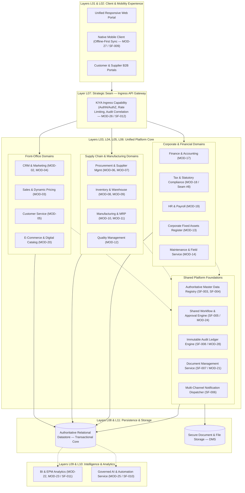

# KIYA 360 — PHASE 1 COMPLETE REVIEW PACKAGE

**Self-Contained External Architecture Review Package**

- **Document ID:** `ARCH-REVIEW-PKG-01`
- **Milestone:** `phase-1-complete-controlled-open-items`
- **Current Status:** `SEALED ARCHITECTURAL BASELINE — READY FOR EXTERNAL ARCHITECTURE AUDIT`
- **Date:** 14 September 2026
- **Prepared By:** Principal Enterprise Architect, Solution Architect, Technical Program Architect, Architecture Governance Lead
- **Target Audience:** Enterprise Architecture Review Board, Technical Advisory Council, Executive Committee

---

## TABLE OF CONTENTS

1. [Executive Summary & Purpose of This Review Package](#1-executive-summary--purpose-of-this-review-package)
2. [Prerequisite Governance & Baseline Requirements Context](#2-prerequisite-governance--baseline-requirements-context)
   - 2.1 [Source of Truth Hierarchy & Operating Rules](#21-source-of-truth-hierarchy--operating-rules)
   - 2.2 [Phase 0 Completion Status & Baseline Scope](#22-phase-0-completion-status--baseline-scope)
   - 2.3 [Approved Business Clarification Decision CD-001](#23-approved-business-clarification-decision-cd-001)
   - 2.4 [Approved Business Clarification Decision CD-002](#24-approved-business-clarification-decision-cd-002)
   - 2.5 [Status & Mapping of Unresolved Open Questions (OQ-003 through OQ-015)](#25-status--mapping-of-unresolved-open-questions-oq-003-through-oq-015)
   - 2.6 [Current Architecture Assumptions & Baseline Invariants](#26-current-architecture-assumptions--baseline-invariants)
3. [Phase 1A: Architecture Strategy & Decision Framework](#3-phase-1a-architecture-strategy--decision-framework)
   - 3.1 [Core Architecture Principles (22 Principles)](#31-core-architecture-principles-22-principles)
   - 3.2 [Quality Attribute Requirements & Evaluation Framework](#32-quality-attribute-requirements--evaluation-framework)
   - 3.3 [The 8 KIYA-Owned Strategic Seams](#33-the-8-kiya-owned-strategic-seams)
   - 3.4 [Domain Disambiguations: Fixed Assets vs. Installed Base & Work Orders](#34-domain-disambiguations-fixed-assets-vs-installed-base--work-orders)
4. [Phase 1B: Candidate Architecture Evaluation & Trade-off Analysis](#4-phase-1b-candidate-architecture-evaluation--trade-off-analysis)
   - 4.1 [Candidate Archetypes Evaluated (A, B, C, D, E)](#41-candidate-archetypes-evaluated-a-b-c-d-e)
   - 4.2 [22-Dimension Comparative Fit Matrix](#42-22-dimension-comparative-fit-matrix)
   - 4.3 [Material Mismatches of Candidate B & Candidate E](#43-material-mismatches-of-candidate-b--candidate-e)
   - 4.4 [Evaluation Verdict: Candidate C (Provisional) & Candidate D (Fallback)](#44-evaluation-verdict-candidate-c-provisional--candidate-d-fallback)
   - 4.5 [Neutralization of Unsupported Certainty (Correction Summary)](#45-neutralization-of-unsupported-certainty-correction-summary)
5. [Phase 1B: Architecture Decision Readiness Summary](#5-phase-1b-architecture-decision-readiness-summary)
6. [Phase 1C: Target Architecture Definition](#6-phase-1c-target-architecture-definition)
   - 6.1 [Architectural Identity: Unified Business Platform Core](#61-architectural-identity-unified-business-platform-core)
   - 6.2 [The 14 Conceptual Architectural Layers](#62-the-14-conceptual-architectural-layers)
   - 6.3 [Target Logical Architecture Diagram](#63-target-logical-architecture-diagram)
   - 6.4 [Core Business Flow Architecture: Customer-to-Cash (C2C)](#64-core-business-flow-architecture-customer-to-cash-c2c)
   - 6.5 [Core Business Flow Architecture: Procure-to-Pay (P2P)](#65-core-business-flow-architecture-procure-to-pay-p2p)
   - 6.6 [Core Business Flow Architecture: Asset-to-Service (A2S)](#66-core-business-flow-architecture-asset-to-service-a2s)
   - 6.7 [Master Data Architecture & Conceptual Ownership](#67-master-data-architecture--conceptual-ownership)
   - 6.8 [Transaction Architecture & Business Status Lifecycle Model](#68-transaction-architecture--business-status-lifecycle-model)
   - 6.9 [Financial Integrity & Double-Entry Posting Boundary](#69-financial-integrity--double-entry-posting-boundary)
   - 6.10 [Global Tax Engine & Statutory Compliance Architecture](#610-global-tax-engine--statutory-compliance-architecture)
   - 6.11 [Shared Workflow & Multi-Channel Notification Architecture](#611-shared-workflow--multi-channel-notification-architecture)
   - 6.12 [Document Management Architecture (DMS / SF-007)](#612-document-management-architecture-dms--sf-007)
   - 6.13 [Multi-Tenancy Architecture & Isolation Evaluation](#613-multi-tenancy-architecture--isolation-evaluation)
   - 6.14 [Artificial Intelligence Architecture & Safety Guardrails](#614-artificial-intelligence-architecture--safety-guardrails)
   - 6.15 [BI, Analytics & Enterprise Performance Management (EPM)](#615-bi-analytics--enterprise-performance-management-epm)
   - 6.16 [Mobile Architecture & Offline-First Synchronization](#616-mobile-architecture--offline-first-synchronization)
7. [Phase 1D: Application, API & Integration Architecture](#7-phase-1d-application-api--integration-architecture)
   - 7.1 [28-Module Logical Application Architecture Mapping](#71-28-module-logical-application-architecture-mapping)
   - 7.2 [Comprehensive Module Ownership Matrix (All 28 Modules)](#72-comprehensive-module-ownership-matrix-all-28-modules)
   - 7.3 [API & Integration Responsibility Matrix](#73-api--integration-responsibility-matrix)
   - 7.4 [Authoritative Master Data Ownership Matrix (14 Master Entities)](#74-authoritative-master-data-ownership-matrix-14-master-entities)
   - 7.5 [Cross-Module Dependency Graph](#75-cross-module-dependency-graph)
   - 7.6 [Event & Transaction Propagation Architecture](#76-event--transaction-propagation-architecture)
8. [Phase 1E: Deployment & Operations Architecture](#8-phase-1e-deployment--operations-architecture)
   - 8.1 [Conceptual Deployment Environments (DEV, TEST, STAGE, PROD)](#81-conceptual-deployment-environments-dev-test-stage-prod)
   - 8.2 [Compute Zoning & Runtime Topology](#82-compute-zoning--runtime-topology)
   - 8.3 [Tenant Lifecycle & Provisional Tenancy Topology](#83-tenant-lifecycle--provisional-tenancy-topology)
   - 8.4 [Background Task Execution & Distributed Scheduling](#84-background-task-execution--distributed-scheduling)
   - 8.5 [Resilience, Fault Isolation & Disaster Recovery](#85-resilience-fault-isolation--disaster-recovery)
   - 8.6 [Structured Telemetry & Operational Observability](#86-structured-telemetry--operational-observability)
   - 8.7 [Customization, Extensibility & Framework Anti-Corruption Layer](#87-customization-extensibility--framework-anti-corruption-layer)
9. [Architecture Decision Records (ADR Register)](#9-architecture-decision-records-adr-register)
   - 9.1 [ADR-001: Provisional Platform Architecture Selection (Full Faithful Content)](#91-adr-001-provisional-platform-architecture-selection-full-faithful-content)
   - 9.2 [Consolidated Summary of ADR-002 through ADR-006](#92-consolidated-summary-of-adr-002-through-adr-006)
10. [Validation, Proof-of-Concept & Legal Gates Register](#10-validation-proof-of-concept--legal-gates-register)
    - 10.1 [Empirical PoC Initiatives (PoC-01 through PoC-04)](#101-empirical-poc-initiatives-poc-01-through-poc-04)
    - 10.2 [Legal Review Gate L-01: Frappe (MIT) vs. ERPNext (GPLv3)](#102-legal-review-gate-l-01-frappe-mit-vs-erpnext-gplv3)
    - 10.3 [Stakeholder Decision Checkpoints (STK-01 through STK-04)](#103-stakeholder-decision-checkpoints-stk-01-through-stk-04)
11. [Architecture Risk Register (14 Classified Risks)](#11-architecture-risk-register-14-classified-risks)
12. [Requirements Traceability & Coverage Audit (238/238 Audit)](#12-requirements-traceability--coverage-audit-238238-audit)
13. [Phase 1 Final Completion Assessment & Gate Verdict](#13-phase-1-final-completion-assessment--gate-verdict)
14. [Current Project Decisions Register (DEC-001 to DEC-019)](#14-current-project-decisions-register-dec-001-to-dec-019)
15. [ERPNext / Frappe Architectural Position Summary](#15-erpnext--frappe-architectural-position-summary)
16. [Phase 2 Readiness & Immediate Action Plan](#16-phase-2-readiness--immediate-action-plan)
17. [Source Document Index](#source-document-index)

---

## 1. EXECUTIVE SUMMARY & PURPOSE OF THIS REVIEW PACKAGE

This review package provides an integrated, comprehensive, self-contained dossier of **Phase 1: Architecture Strategy, Candidate Evaluation, Target Architecture, Application/API/Integration Architecture, Deployment Architecture, and Governance** for the KIYA 360 platform.

It is prepared specifically for external and internal architectural auditors, enterprise evaluators, and executive stakeholders. It compiles the foundational business decisions from Phase 0, the governing architectural principles of Phase 1A, the rigorous trade-off evaluations of Phase 1B, the detailed structural designs of Phase 1C, 1D, and 1E, and the complete governance apparatus (decisions, validation gates, risks, and traceability).

### Formal Gate Verdict
The Architecture Governance Board has sealed Phase 1 with the status:
$$\mathbf{PHASE\ 1\ COMPLETE\ WITH\ CONTROLLED\ OPEN\ ITEMS\ —\ READY\ FOR\ PHASE\ 2}$$

This status certifies that:
1. All 28 modules and 238 functional requirement records from the approved Phase 0 baseline have an architecture traceability mapping. This establishes architectural coverage, not implementation completeness or technical validation.
2. The platform is designed as a unified single-core CRM + ERP system, avoiding both distributed microservices sprawl and unmaintainable monolithic coupling.
3. No premature technology selections, unverified delivery timelines, staffing estimates, or synthetic performance guarantees were manufactured.
4. All unresolved business questions, empirical technical validations, and legal licensing questions are explicitly captured in governance registers and safely deferred to Phase 2.

---

## 2. PREREQUISITE GOVERNANCE & BASELINE REQUIREMENTS CONTEXT

*(Faithfully summarized from Phase 0 baselines and project control files)*

### 2.1 Source of Truth Hierarchy & Operating Rules
Under the governing rules of `AGENTS.md`, the platform enforces an absolute hierarchy of authority:
1. Current approved BRD: `source/KIYA360_BRD.pdf` (Version 2.0, 13 September 2026).
2. Approved requirements documentation under `docs/00-requirements/`.
3. Approved project decisions in `.kiya/AI-DECISIONS.md`.
4. Current-state snapshot: `docs/PROJECT-STATE.md`.
5. Current phase specifications and handoff: `.kiya/AI-HANDOFF.md`.
6. Implementation/code, when an authorized phase creates it.
7. Agent suggestions.

*Operating Rule:* An agent suggestion must never silently override an authoritative requirement or decision. Missing details must remain explicitly classified as `TBD` or `OPEN`.

### 2.2 Phase 0 Completion Status & Baseline Scope
Phase 0 was formally sealed on 14 September 2026 under status `PASS WITH CORRECTIONS` (`docs/00-requirements/36-phase-0-completion-assessment.md`).
- **Scope Baseline:** Exactly 28 distinct modules (`MOD-01` through `MOD-28`) encompassing Platform & Admin, CRM, Sales, Marketing, Customer Service, Procurement, Supplier Management, Inventory, Warehouse, Manufacturing, MRP & Planning, Quality, Asset Management, Maintenance & Field Service, Logistics, Projects, Finance & Accounting, Tax & Statutory Compliance, HR & Payroll, E-Commerce, DMS, BI, EPM, Workflow, AI, Integration, Mobile, and Audit/Security.
- **Requirement Counting Baseline:** The Phase 0 functional requirement baseline consists of exactly **238 functional requirement records** (`docs/00-requirements/02-module-inventory.md`).
  > *Clarification on Record Counting & Traceability:* The 238/238 figure represents the Phase 0 functional requirement record baseline. Detailed C2C, P2P and A2S records are subordinate elaborations and must not be numerically conflated with the 238 functional requirement records. All 238 Phase 0 functional requirement records have an architecture traceability mapping. This establishes architectural coverage, not implementation completeness or technical validation.
- **Shared Foundations:** Exactly 15 enterprise horizontal foundations (`SF-001` to `SF-015`) governing multi-company context, access control, master data management, conceptual master usage, shared workflows, notifications, DMS, audit trails, mobile offline sync, AI insights, real-time dashboards/EPM, API management, numbering series, common record capabilities, and scalable 24/7 operations.
- **Dependencies:** Exactly 11 critical cross-module dependencies (`DEP-001` to `DEP-011`).

### 2.3 Approved Business Clarification Decision CD-001
- **Decision Record:** `docs/00-requirements/29-cd001-scope-expansion-hybrid-model.md`
- **Status:** `APPROVED BUSINESS DECISION`
- **Date:** 14 September 2026
- **Decision:** Adopt a **Hybrid Scope-Expansion Model** for KIYA 360: Build the complete business flow according to the BRD and use ERP-standard behavior whenever needed as a reference/baseline.
- **Mandatory Interpretation:**
  - KIYA implements the BRD-defined scope.
  - ERP-standard behavior is a reference baseline, NOT an automatic production reuse commitment.
  - ERPNext behavior does NOT automatically become a KIYA requirement.
  - KIYA is NOT "ERPNext with a new UI."

### 2.4 Approved Business Clarification Decision CD-002
- **Decision Record:** `docs/00-requirements/30-cd002-transactional-lifecycle-business-status.md`
- **Status:** `APPROVED BUSINESS DECISION`
- **Date:** 14 September 2026
- **Decision:** Use **Business Status** as the primary transactional lifecycle and document state model.
- **Mandatory Interpretation:**
  - Business Status is the primary transactional lifecycle model.
  - ERPNext `docstatus` is NOT the KIYA architectural or user-facing lifecycle.
  - The legacy Draft/Submitted/Cancelled binary state mechanism is explicitly rejected as a KIYA requirement.
  - The 8 commercial status milestones (`Draft`, `Pending Approval`, `Approved`, `In Progress`, `Partially Completed`, `Completed`, `Closed`, `Cancelled`) represent an illustrative/proposed operational progression; exact status taxonomy and state transitions are to be progressively defined per domain in detailed design.
  - Posted financial and inventory effects are not physically overwritten or deleted; cancellations are performed through controlled adjustment, reversal, or other approved accounting mechanisms while preserving historical auditability (`DEC-009`).

### 2.5 Status & Mapping of Unresolved Open Questions (OQ-003 through OQ-015)
In strict compliance with governance rules, questions `OQ-003` through `OQ-015` remain explicitly **OPEN / TBD**, matching their exact definitions and scopes in `docs/00-requirements/06-open-questions.md`:

| Question ID | Exact Phase 0 Subject / Meaning | Current Status | Architectural Impact & Handling in Phase 1 | Deferred Resolution Gate |
| :--- | :--- | :--- | :--- | :--- |
| **OQ-003** | Approval conditions, matrices, thresholds, escalation timing, and delegation rules | `OPEN / TBD` | Shared Workflow Engine (`SF-005` / `MOD-24`) designed to support dynamic threshold rules. | Stakeholder Gate `STK-01` |
| **OQ-004** | Notification triggers across channels (email, WhatsApp, SMS, push, in-app) and templates | `OPEN / TBD` | Multi-Channel Dispatcher (`SF-006`) decoupled from domain event triggers. | Stakeholder Gate `STK-01` |
| **OQ-005** | Tax-country rule sets initially in scope besides India + reference country, and statutory filing behavior | `OPEN / TBD` | Tax domain (`MOD-18`) isolated behind anti-corruption adapter and Seam #8. | Stakeholder Gate `STK-02` / `PoC-02` |
| **OQ-006** | Payroll and statutory calculations required for India and reference country | `OPEN / TBD` | Modular salary formula calculation engine isolated within HR & Payroll (`MOD-19`). | Stakeholder Gate `STK-03` |
| **OQ-007** | Rules defining inventory reservation, valuation application, shortages, and availability-check outcomes | `OPEN / TBD` | Two-phase inventory reservation modeled within Inventory (`MOD-08`) and Warehouse (`MOD-09`). | Phase 2 Functional Design |
| **OQ-008** | Rules governing demand/planning, capacity, work-order release, and exceptions | `OPEN / TBD` | MRP engine (`MOD-11`) triggers standard planning proposals; rules configurable. | Phase 2 Functional Design |
| **OQ-009** | Inspection criteria, acceptance/rejection rules, and NCR/CAPA lifecycle | `OPEN / TBD` | QC hold and quarantine workflow modeled within Quality Management (`MOD-12`). | Phase 2 Functional Design |
| **OQ-010** | Supplier-evaluation and performance-scorecard measures and calculations | `OPEN / TBD` | Scoring criteria linked to Supplier Management (`MOD-07`) and Procurement (`MOD-06`). | Phase 2 Functional Design |
| **OQ-011** | Asset installation, warranty, dispatch, spare-parts, and service-billing rules | `OPEN / TBD` | Dispatch and assignment heuristics isolated within Maintenance & Field Service (`MOD-14`). | Phase 2 Functional Design |
| **OQ-012** | Third-party systems, API/webhook events, data-sync rules, and error-handling expectations | `OPEN / TBD` | Pluggable API gateway and integration adapters defined within `MOD-26` / `SF-012`. | Phase 2 Functional Design |
| **OQ-013** | Offline data, conflict resolution, synchronization behavior, and supported mobile tasks | `OPEN / TBD` | Local encrypted storage, UUIDs, and outbox sync engine defined (`MOD-27` / `SF-009`). | Validation `PoC-04` |
| **OQ-014** | Data-access boundaries, human-review rules, outcome criteria, and governance for AI and automation | `OPEN / TBD` | AI safety guardrails and human-in-the-loop controls enforced (`MOD-25` / `SF-010`). | Phase 2 Functional Design |
| **OQ-015** | Measurable availability, performance, scalability, security-monitoring, and real-time latency targets | `OPEN / TBD` | Horizontal scaling architecture defined; quantitative SLA targets deferred to benchmarking. | `PoC-03` & Gate `STK-04` |

### 2.6 Current Architecture Assumptions & Baseline Invariants
- **Assumption 1:** A relational transactional datastore with ACID capabilities is required for financial ledger correctness and inventory balance integrity; exact DBMS selection remains subject to technical evaluation.
- **Assumption 2:** The primary commercial deployment model will be cloud-hosted multi-tenant SaaS, with architectural support for dedicated single-tenant enterprise deployments.
- **Assumption 3:** India represents the primary initial statutory tax jurisdiction, with architecture abstracting statutory calculation into a pluggable engine (`MOD-18`) capable of international expansion.
- **Invariant 1:** Customer Installed Base (`MOD-14`) and Corporate Fixed Assets (`MOD-13`) remain separate authoritative business entities with distinct lifecycle, ownership, and business semantics. They may share underlying persistence infrastructure where architecturally appropriate (logical separation, not mandatory physical schema split).
- **Invariant 2:** Field Service Work Orders (`MOD-14`) and Discrete Manufacturing Work Orders (`MOD-10`) are fundamentally distinct operational entities.
- **Invariant 3:** AI agents operate strictly in an advisory and assistive capacity; they are strictly prohibited from directly committing unassisted financial journals, modifying inventory balances, or authorizing payments without human review.

---

## 3. PHASE 1A: ARCHITECTURE STRATEGY & DECISION FRAMEWORK

*(Faithfully summarized from `docs/02-architecture/01-architecture-strategy-and-decision-framework.md`)*

### 3.1 Core Architecture Principles (22 Principles)
1. **Business-Driven Architecture:** Technology choices must serve BRD functional scope, not engineering preferences.
2. **Unified Core Platform:** One authoritative transactional persistence core; no synchronization silos between CRM and ERP.
3. **Single Source of Truth:** Authoritative conceptual ownership for all master data entities (`DEC-007`).
4. **Decoupled Business Status:** Transaction lifecycles governed by operational milestones (`CD-002`).
5. **Atomic Financial Integrity:** Double-entry balancing strictly enforced at the transaction boundary.
6. **Immutable Audit Ledger:** Non-erasable, append-only audit logging for all mutations (`SF-008`).
7. **Strict Multi-Tenancy Isolation:** Zero data leakage across tenant boundaries (`SF-001`).
8. **Statutory Tax Decoupling:** Pluggable Tax & Statutory Compliance domain (`MOD-18`) abstracted from operational modules.
9. **Governed Extensibility:** Proprietary business logic insulated from framework internals via anti-corruption adapters.
10. **Zero Upstream Modifications:** Upstream framework code must never be edited directly.
11. **Native Mobile-First with Offline Sync:** Field operations must function reliably in disconnected environments (`SF-009`).
12. **Asynchronous Heavy Workloads:** Heavy reporting, PDF rendering, and AI inference must not block interactive OLTP.
13. **Pluggable Integration Architecture:** Standard contract-governed APIs and idempotent webhooks for external systems (`SF-012`).
14. **Assistive AI with Human-in-the-Loop:** Machine intelligence cannot commit financial or statutory transactions without human review.
15. **Stateless Interactive Application Tier:** Web application servers operate statelessly to support horizontal elasticity.
16. **Perpetual Inventory Valuation:** Real-time financial ledger reflection of physical stock movements.
17. **Strict 3-Way Procurement Matching:** Automated verification of Purchase Orders, Goods Receipts, and Invoices.
18. **Configurable Enterprise Workflow:** Centralized approval engine supporting multi-tier routing and delegation (`SF-005`).
19. **Unified Ingress & Perimeter Security:** Ingress capability enforcing authentication, rate limits, and audit logging.
20. **Deterministic Concurrency Control:** Optimistic locking and transactional isolation to prevent lost updates.
21. **Comprehensive Structured Observability:** Universal correlation IDs tracing requests across all tiers.
22. **Evidence-Based Architectural Reversibility:** Architecture must remain adaptable if candidate frameworks fail empirical PoC gates.

### 3.2 Quality Attribute Requirements & Evaluation Framework
The architecture defines 22 evaluation dimensions encompassing functional fidelity, security, multi-tenancy, data integrity, concurrency, upgradability, and legal compliance. Measurable quantitative NFR targets (throughput, latency, concurrency) remain tied to `OQ-015` and will be benchmarked in `PoC-03`.

### 3.3 The 8 KIYA-Owned Strategic Seams
To maintain intellectual property ownership and enable platform reversibility, KIYA strictly owns 8 architectural seams:
1. **Seam #1: Product & Platform Boundaries:** Complete ownership of proprietary business workflows (Enquiry, C2C, Field Service).
2. **Seam #2: SaaS Control Plane & Tenancy Orchestration:** Automated provisioning, billing, and tenant lifecycle governance.
3. **Seam #3: Unified API Gateway & Ingress Perimeter:** Authentication, rate limiting, and contract versioning.
4. **Seam #4: AI Governance & Task Automation:** Centralized LLM gateway, prompt auditing, and safety guardrails.
5. **Seam #5: Enterprise BI, Operational Analytics & EPM:** Decoupled analytical reporting and financial consolidation.
6. **Seam #6: User Experience, Web & Mobile Clients:** Modern responsive web UI and native offline mobile apps.
7. **Seam #7: Security, Identity, RBAC & Audit:** Universal access governance and immutable compliance logging.
8. **Seam #8: Global Tax Engine & India Statutory Compliance:** Pluggable tax calculation, e-invoicing, and e-way bill generation.

### 3.4 Domain Disambiguations: Fixed Assets vs. Installed Base & Work Orders
- **Customer Installed Base (`MOD-14`):** External serialized assets owned by customers or maintained under AMC. Tracks warranties, breakdown tickets, and mobile field service dispatches.
- **Corporate Fixed Assets (`MOD-13`):** Internal enterprise capital assets. Tracks capitalization, statutory depreciation (Companies Act / Tax WDV), and disposal journals.
- **Work Order Separation:** Field Service Work Orders (`MOD-14`) are strictly decoupled from Discrete Manufacturing Work Orders (`MOD-10`).

---

## 4. PHASE 1B: CANDIDATE ARCHITECTURE EVALUATION & TRADE-OFF ANALYSIS

*(Faithfully summarized from `docs/02-architecture/02-candidate-architecture-evaluation.md` and `docs/02-architecture/03-architecture-decision-readiness.md`)*

### 4.1 Candidate Archetypes Evaluated
- **Candidate A: Full Custom Architecture:** Custom backend services, custom frontend, clean-room custom double-entry GL and inventory engine.
- **Candidate B: ERPNext-Primary Monolith:** Standard ERPNext deployed as the platform core, extending DocTypes directly via standard hooks.
- **Candidate C: Frappe Framework + Selective ERPNext Core Reuse Under Evaluation:** Frappe Framework as the metadata runtime and ORM; selective reuse of proven ERPNext Accounts and Stock Ledger evaluated via formal anti-corruption adapters; custom KIYA apps for proprietary domains.
- **Candidate D: Frappe Framework + Mostly Custom KIYA Applications:** Frappe Framework as the metadata runtime; bespoke custom KIYA applications for all business domains (including clean-room custom double-entry GL and inventory), completely excluding ERPNext code.
- **Candidate E: Modular Headless / API-First Architecture:** Bounded domain services communicating via APIs and event streams; evaluated across modular monolithic, service-oriented, and selectively distributed deployment topologies.

### 4.2 22-Dimension Comparative Fit Matrix Summary

| # | Architecture Dimension | Candidate A (Custom) | Candidate B (ERPNext) | Candidate C (Frappe + Selective) | Candidate D (Frappe + Custom) | Candidate E (Modular Headless) |
| :- | :--- | :--- | :--- | :--- | :--- | :--- |
| 1 | **BRD 28-Module Coverage** | Complete (Build) | High (60% native) | High (Native + Reused) | Complete (Build) | Complete (Build) |
| 2 | **Core Flow Fidelity (C2C/P2P/A2S)** | High | Low (docstatus clash) | Adequate (via Adapters) | High (Native) | High (Native) |
| 3 | **Decision CD-001 Compliance** | Full | Partial | Full | Full | Full |
| 4 | **Decision CD-002 Compliance** | Full | **FAIL (docstatus)** | Compliant (via Adapter) | Full | Full |
| 5 | **Unified Master Data Model** | Full | Moderate | Full | Full | Moderate to Low |
| 6 | **Double-Entry GL Integrity** | High (Heavy Build) | High (Proven) | High (Subject to Eval) | High (Heavy Build) | Low (Distributed Sagas)|
| 7 | **India GST & E-Invoicing** | High (Build) | Low (Removed upstream)| High (Via Seam #8) | High (Build) | High (Build) |
| 8 | **8 Strategic Seams Ownership** | Full | **FAIL (Locked in)** | Full (Isolated Adapters)| Full | Full |
| 9 | **Multi-Tenancy Isolation** | High (Custom) | Moderate (Bench site) | High (Frappe Site Model)| High (Frappe Site Model)| High (Complex Infra) |
| 10| **Mobile Offline Sync** | High (Custom) | Low (Weak mobile sync)| Adequate (Custom app) | High (Custom app) | High (Custom) |
| 11| **AI & Intelligent Automation** | Full | Low (Coupled) | High (Via Seam #4) | High (Via Seam #4) | High |
| 12| **BI / Analytics / EPM** | High | Low (Monolithic DB) | High (Via Read Replicas)| High (Via Read Replicas)| High |
| 13| **Extensibility & Upgradability** | High | Low (Brittle hooks) | High (Clean custom apps)| High (Clean custom apps)| High |
| 14| **Intellectual Property Control** | 100% Proprietary | **Low (GPLv3 exposure)**| Balanced (GPLv3 Seam) | 100% MIT/Proprietary | 100% Proprietary |
| 15| **Architectural Reversibility** | High | Low (Vendor Lock-in)| High (Anti-Corruption) | High | Moderate |
| 16| **Operational Simplicity** | Moderate | High | High | High | Variable (Topology dependent)|
| 17| **Engineering Complexity** | High | Moderate | Moderate | High | High to Extreme |
| 18| **Long-Term Maintainability** | High | Low | High | High | Moderate |
| 19| **Enterprise SLA Fit** | High | Moderate | Moderate (PoC required)| High | High |
| 20| **License & Commercial Risk** | Zero | **High (GPLv3 SaaS)** | Medium (Gate L-01 Gate) | Zero (Pure MIT) | Zero |
| 21| **Delivery Velocity** | Low | High initial / Slow late| High | Moderate | Low |
| 22| **Overall Recommendation** | Viable Baseline | **Material Mismatch** | **Provisional Leader** | **Evaluated Fallback** | **Less Suited for Core ERP**|

### 4.3 Material Mismatches of Candidate B & Candidate E
- **Candidate B (ERPNext-Primary Monolith):** Formally determined to be **materially mismatched** with KIYA 360 requirements:
  1. Direct structural violation of approved decision `CD-002`: ERPNext core transactions are structurally tied to binary `docstatus` integers (0, 1, 2), which cannot natively support KIYA's operational business statuses.
  2. Substantial functional gaps: Missing dedicated Enquiry, multi-envelope RFP bidding, coordinate bin WMS, and comprehensive Field Service Work Orders.
  3. Commercial and legal exposure: Deep coupling to ERPNext's GPLv3 codebase creates licensing ambiguity for proprietary KIYA intellectual property.
- **Candidate E (Modular Headless / API-First Architecture):** Evaluated fairly across deployment options; determined to be **less suited for KIYA's core transactional ERP**:
  1. Distributing double-entry general ledgers, perpetual inventory valuation, and procurement commitments across distributed datastores introduces high transactional coordination complexity (two-phase commits or eventual consistency sagas).
  2. Candidate E remains viable for peripheral services (e-commerce, customer portal), but early platform core transactional architecture benefits from a unified relational persistence core.

### 4.4 Evaluation Verdict: Candidate C (Provisional) & Candidate D (Fallback)
- **Candidate C (Frappe Framework + Selective ERPNext Core Reuse Under Evaluation):** Selected as the **Provisional Leading Architectural Direction** under `ADR-001`. It balances delivery velocity by evaluating selective reuse of proven double-entry ledger algorithms and stock valuation tables, while strictly isolating proprietary KIYA business domains within custom Frappe apps. Conditioned upon passing `PoC-01` through `PoC-04` and `Gate L-01`.
- **Candidate D (Frappe Framework + Mostly Custom KIYA Applications):** Designated as the **Evaluated Fallback / Contingency Option**. If `Gate L-01` legal review identifies copyleft contamination risks from ERPNext's GPLv3 license, or if ERPNext's submission model proves intractable in `PoC-01`, the project can pivot to Candidate D, implementing clean-room custom accounting and inventory engines on the MIT-licensed Frappe Framework. Candidate D is designed to minimize rework through stable architectural boundaries.

### 4.5 Neutralization of Unsupported Certainty (Correction Summary)
In the Phase 1 Quality-Control pass, all unverified metrics, synthetic delivery durations, staffing numbers, and premature commitments were audited and excised:
- Excised synthetic delivery timelines (e.g., historical estimates like "18-24 months" or "6-9 months").
- Excised unverified performance claims (e.g., "guaranteeing sub-second response times", "500 requests/sec").
- Excised premature technology lock-in (specific runtimes, databases, and deployment orchestrators remain evaluation options).
- Neutralized definitive legal declarations; established formal legal review gate (`Gate L-01`).

---

## 5. PHASE 1B: ARCHITECTURE DECISION READINESS SUMMARY

*(Faithfully summarized from `docs/02-architecture/03-architecture-decision-readiness.md`)*

The Phase 1B Decision Readiness review confirmed that:
1. The empirical and requirements foundation is sufficient to define the Target Architecture (Phase 1C), Application Architecture (Phase 1D), and Deployment Architecture (Phase 1E).
2. Four mandatory Proof-of-Concept initiatives (`PoC-01` SaaS plane, `PoC-02` India tax, `PoC-03` concurrency scaling, `PoC-04` mobile offline) and one legal review gate (`Gate L-01`) must be executed in Phase 2 before committing to production implementation.
3. Candidate C is provisional; Candidate D is an evaluated fallback designed to minimize rework through stable architectural boundaries.

---

## 6. PHASE 1C: TARGET ARCHITECTURE DEFINITION

*(Faithfully summarized from `docs/02-architecture/04-target-architecture.md`)*

### 6.1 Architectural Identity: Unified Business Platform Core
KIYA 360 is conceptually architected as an integrated CRM + ERP platform sharing an authoritative transactional relational persistence layer. Modularity is logical (bounded domain contexts) rather than physically fragmented micro-applications.

### 6.2 The 14 Conceptual Architectural Layers
The system is organized into 14 distinct logical layers with strict unidirectional dependencies:
- **L01: User Experience (UX) / Client:** Responsive web portals, enterprise desktop workspaces, and tablet UI.
- **L02: Mobile Experience:** Native-grade field mobility, barcode/QR scanning, local encrypted storage, and offline sync (`MOD-27` / `SF-009`).
- **L03: Application / Business Capability:** Domain orchestration, user intent handling, and use case controllers.
- **L04: Shared Platform / Foundation:** Multi-tenancy context, auto-numbering (`SF-013`), localization, and currency conversion.
- **L05: Transaction / Domain Processing:** Business entity encapsulation, operational business status (`CD-002`), and GL posting rules.
- **L06: Workflow / Automation:** Multi-level approval routing, dynamic escalation, and delegation governance (`MOD-24` / `SF-005`).
- **L07: Integration / API Layer:** Ingress API Gateway, rate limiting, authentication termination, and webhook dispatch (`MOD-26` / `SF-012`).
- **L08: Data / Persistence Layer:** Authoritative relational datastore, schema enforcement, and tenant isolation.
- **L09: Analytics / BI / EPM Layer:** Decoupled operational reporting, KPI scorecards, read replicas, and financial consolidation (`MOD-22`, `MOD-23` / `SF-011`).
- **L10: AI / Intelligent Automation:** Governed machine learning, prompt auditing, predictive scoring, and assistive RPA (`MOD-25` / `SF-010`).
- **L11: Document Management (DMS):** Secure object storage, metadata indexing, cryptographic hashing, and digital signing (`MOD-21` / `SF-007`).
- **L12: Identity, Security & Audit:** RBAC/ABAC gatekeeping, session controls, and immutable compliance audit ledger (`MOD-28` / `SF-002`, `SF-008`).
- **L13: Observability & Operations:** Distributed request tracing, structured logging, and health telemetry (`SF-015`).
- **L14: External Systems & Interop:** Anti-corruption adapters for India GSTN, e-way portals, banks, and payment gateways.

### 6.3 Target Logical Architecture Diagram



### 6.4 Core Business Flow Architecture: Customer-to-Cash (C2C)
Traces the revenue cycle across 18 detailed stages (`DR-C2C-001`..`018`):
`Inbound Lead / Opportunity` $\rightarrow$ `Dedicated Enquiry (Differentiator)` $\rightarrow$ `Quotation` $\rightarrow$ `Sales Order Confirmation` $\rightarrow$ `Two-Phase Inventory Reservation` $\rightarrow$ `MRP / Production Trigger` $\rightarrow$ `Quality Inspection` $\rightarrow$ `Warehouse Picking & Sequential Dispatch Note` $\rightarrow$ `Tax Determination (IRN & e-Way Bill)` $\rightarrow$ `Sales Invoicing` $\rightarrow$ `Atomic GL Posting (AR Debit, Revenue Credit, Tax Credit)` $\rightarrow$ `Bank Settlement & AR Clearing` $\rightarrow$ `Customer 360 Profitability Aggregation`.

> *Note on Dedicated Enquiry:* The dedicated Enquiry capability is represented as part of the Customer-to-Cash flow. Organizational/domain ownership is not asserted beyond what the BRD explicitly establishes and will be finalized during detailed domain design.

### 6.5 Core Business Flow Architecture: Procure-to-Pay (P2P)
Traces the expenditure cycle across 12 detailed stages (`DR-P2P-001`..`012`):
`Purchase Requisition` $\rightarrow$ `Multi-Envelope RFQ/RFP` $\rightarrow$ `Bid Comparison & Award` $\rightarrow$ `Purchase Order` $\rightarrow`Goods Receipt Note (GRN)` $\rightarrow$ `QC Quarantine & Inspection` $\rightarrow$ `Inventory Stock In Hand Debit / GRN Accrual Credit` $\rightarrow$ `Supplier Invoice Verification` $\rightarrow$ `Automated 3-Way Matching (PO vs GRN vs Invoice)` $\rightarrow$ `Statutory Tax & Withholding (TDS/ITC)` $\rightarrow$ `AP Voucher Posting` $\rightarrow$ `Payment Disbursement & Bank Advice` $\rightarrow$ `Supplier Performance Update`.

### 6.6 Core Business Flow Architecture: Asset-to-Service (A2S)
Traces the service lifecycle across 11 detailed stages (`DR-A2S-001`..`011`) while strictly enforcing the Customer Installed Base vs. Corporate Fixed Asset boundary:
`Customer Incident Logged` $\rightarrow$ `Service Desk Ticket & Warranty Verification` $\rightarrow$ `Field Service Work Order (FS-WO) Dispatch` $\rightarrow$ `Mobile Technician Offline Capture` $\rightarrow$ `Spare Parts Issued from Van Stock` $\rightarrow$ `On-Site Execution & Digital Signature` $\rightarrow$ `Bidirectional Synchronization` $\rightarrow$ `Service Invoicing & Warranty Settlement`. Internal Corporate Fixed Assets follow independent capitalization and statutory depreciation schedules.

### 6.7 Master Data Architecture & Conceptual Ownership
Enforces a single conceptual master record across all domains (`DEC-007`). Authoritative conceptual ownership eliminates duplicate customer, supplier, item, or facility definitions.

### 6.8 Transaction Architecture & Business Status Lifecycle Model
Implements approved decision `CD-002`. Business Status is the approved primary lifecycle model. The 8 operational statuses (`Draft`, `Pending Approval`, `Approved`, `In Progress`, `Partially Completed`, `Completed`, `Closed`, `Cancelled`) represent an illustrative/proposed operational progression; exact status sequences and transition validation rules are to be defined progressively during detailed design. All transitions generate immutable audit entries (`SF-008`). Posted financial effects are not physically overwritten or deleted; cancellations are performed through controlled adjustment, reversal, or other approved accounting mechanisms (`DEC-009`).

### 6.9 Financial Integrity & Double-Entry Posting Boundary
The General Ledger is an immutable, double-entry journal ($\sum \text{Debits} = \sum \text{Credits}$). Closed fiscal period locks, multi-currency parity checks, and perpetual inventory integration ensure complete financial correctness.

### 6.10 Global Tax Engine & Statutory Compliance Architecture
Taxation is authoritatively housed within Tax & Statutory Compliance (`MOD-18` / Seam #8). Handles tax determination, HSN/SAC resolution, CGST/SGST/IGST calculation, withholding (TDS/TCS), and seamless integration with the India GSTN/NIC e-invoice and e-way bill portals via anti-corruption adapters.

### 6.11 Shared Workflow & Multi-Channel Notification Architecture
- **Workflow (`SF-005` / `MOD-24`):** Universal approval engine supporting dynamic threshold-based routing, SLA escalations, and temporary delegations across all 28 modules.
- **Notifications (`SF-006`):** Decoupled event-driven dispatcher formatting and delivering messages across Email, SMS, WhatsApp Business, Mobile Push, and In-App channels.

### 6.12 Document Management Architecture (DMS / SF-007)
Document Management (`MOD-21` / `SF-007`) provides a centralized document metadata index linking files to parent business entities. Binary files are stored in secure object storage with cryptographic verification and digital signature capabilities.

### 6.13 Multi-Tenancy Architecture & Isolation Evaluation
The architecture enforces strict logical tenant isolation (`SF-001`). The **Database-per-Tenant model** is evaluated as the provisional candidate topology (`ADR-005`), offering robust operational isolation. Tenancy implementation remains subject to empirical validation in `PoC-01`.

### 6.14 Artificial Intelligence Architecture & Safety Guardrails
AI & Automation (`MOD-25` / `SF-010`) is a horizontal platform capability. Invariant guardrail: AI operates in an advisory and assistive capacity only; it is strictly prohibited from directly posting financial journals, adjusting inventory balances, or authorizing payments without human review.

### 6.15 BI, Analytics & Enterprise Performance Management (EPM)
Heavy reporting, ad-hoc queries, and multi-entity financial consolidation (`MOD-22`, `MOD-23` / `SF-011`) are decoupled from operational OLTP processing and routed to read replicas or analytical marts (`ADR-006`).

### 6.16 Mobile Architecture & Offline-First Synchronization
Mobile operations (`MOD-27` / `SF-009`) utilize local encrypted storage, client-generated UUIDs, and an outbox queue pattern to allow full offline field service execution with deterministic conflict resolution upon network reconnection.

---

## 7. PHASE 1D: APPLICATION, API & INTEGRATION ARCHITECTURE

*(Faithfully summarized from `docs/02-architecture/05-application-api-integration-architecture.md`)*

### 7.1 28-Module Logical Application Architecture Mapping
All 28 BRD modules are mapped into six logical domain clusters using exact BRD identifiers:
1. **Front-Office & Customer Engagement:** `MOD-01` Platform & Admin, `MOD-02` CRM, `MOD-03` Sales, `MOD-04` Marketing, `MOD-05` Customer Service, `MOD-20` E-Commerce.
2. **Supply Chain, Manufacturing & Operations:** `MOD-06` Procurement, `MOD-07` Supplier Management, `MOD-08` Inventory, `MOD-09` Warehouse, `MOD-10` Manufacturing, `MOD-11` MRP & Planning, `MOD-12` Quality, `MOD-15` Logistics & Transportation.
3. **Asset & Maintenance Lifecycle:** `MOD-13` Asset Management (Corporate Fixed Assets), `MOD-14` Maintenance & Field Service (Customer Installed Base).
4. **Corporate Governance, Finance & Legal:** `MOD-16` Projects, `MOD-17` Finance & Accounting, `MOD-18` Tax & Statutory Compliance.
5. **Human Capital Management:** `MOD-19` HR & Payroll.
6. **Cross-Cutting Foundations, Intelligence & Administration:** `MOD-21` Document Management, `MOD-22` Business Intelligence, `MOD-23` EPM / Budget / Forecast, `MOD-24` Workflow & Approvals, `MOD-25` AI & Automation, `MOD-26` Integration & API, `MOD-27` Mobile Application, `MOD-28` Audit, Security & Compliance.

### 7.2 Comprehensive Module Ownership Matrix (All 28 Modules)
Every one of the 28 modules appears exactly once as the primary owner:

| Module ID | Authoritative BRD Module Name | Primary Business Capability | Logical Domain Cluster | Key Dependencies | Shared Foundations Utilized | Architecture Status |
| :--- | :--- | :--- | :--- | :--- | :--- | :--- |
| **MOD-01** | Platform & Administration | Multi-company structure, global settings, RBAC controls | Administration | None | `SF-001`, `SF-002`, `SF-013` | Baselined |
| **MOD-02** | CRM | Lead, opportunity, pipeline, account management | Front-Office | `MOD-01`, `MOD-03` | `SF-003`, `SF-004`, `SF-005`, `SF-006` | Baselined |
| **MOD-03** | Sales | Quotations, pricing, sales orders, contracts | Front-Office | `MOD-02`, `MOD-08`, `MOD-17`, `MOD-18`| `SF-003`, `SF-005`, `SF-006`, `SF-013` | Baselined |
| **MOD-04** | Marketing | Campaigns, lead capture, segmentations | Front-Office | `MOD-02` | `SF-003`, `SF-006` | Baselined |
| **MOD-05** | Customer Service | Case/ticket management, SLA tracking, feedback, knowledge base | Front-Office | `MOD-02`, `MOD-03`, `MOD-14` | `SF-003`, `SF-005`, `SF-006`, `SF-007` | Baselined |
| **MOD-06** | Procurement | Purchase requisitions, RFQ/RFP, POs, 3-way match | Supply Chain | `MOD-07`, `MOD-08`, `MOD-17`, `MOD-18`| `SF-003`, `SF-005`, `SF-006`, `SF-013` | Baselined |
| **MOD-07** | Supplier Management | Onboarding, supplier qualification, scorecarding | Supply Chain | `MOD-06` | `SF-003`, `SF-004`, `SF-007` | Baselined |
| **MOD-08** | Inventory | Stock ledger, FIFO/moving avg valuation, ATP reservation| Supply Chain | `MOD-09`, `MOD-17` | `SF-003`, `SF-004`, `SF-013` | Baselined |
| **MOD-09** | Warehouse | Bins, pick-pack-ship, dispatch notes, transfers | Supply Chain | `MOD-08`, `MOD-15` | `SF-003`, `SF-004`, `SF-013` | Baselined |
| **MOD-10** | Manufacturing | Work centers, routings, discrete work orders, scrap | Operations | `MOD-08`, `MOD-11`, `MOD-12` | `SF-003`, `SF-005`, `SF-013` | Baselined |
| **MOD-11** | MRP & Planning | Demand forecasting, BOM explosion, MPS/MRP generation | Operations | `MOD-03`, `MOD-06`, `MOD-08`, `MOD-10`| `SF-003`, `SF-010`, `SF-011` | Baselined |
| **MOD-12** | Quality | Inspection checklists, quarantine hold, NCR | Operations | `MOD-06`, `MOD-08`, `MOD-10` | `SF-005`, `SF-007`, `SF-008` | Baselined |
| **MOD-13** | Asset Management | Corporate fixed assets, depreciation, asset registers | Corporate | `MOD-17`, `MOD-18` | `SF-003`, `SF-004`, `SF-008` | Baselined |
| **MOD-14** | Maintenance & Field Service | Customer installed base, warranties, field dispatch | Field Operations| `MOD-03`, `MOD-05`, `MOD-08`, `MOD-17`| `SF-003`, `SF-005`, `SF-009`, `SF-013` | Baselined |
| **MOD-15** | Logistics & Transportation | Carrier tracking, vehicle dispatch, freight reconciliation| Supply Chain | `MOD-03`, `MOD-06`, `MOD-09` | `SF-003`, `SF-006`, `SF-012` | Baselined |
| **MOD-16** | Projects | Project WBS, task tracking, milestone billing | Operations | `MOD-03`, `MOD-06`, `MOD-17`, `MOD-19`| `SF-003`, `SF-005`, `SF-011` | Baselined |
| **MOD-17** | Finance & Accounting | General ledger, AR/AP, bank reconciliation, vouchers | Corporate | All transaction modules (`DEP-005`) | `SF-001`, `SF-003`, `SF-004`, `SF-008` | Baselined |
| **MOD-18** | Tax & Statutory Compliance | GST determination, e-invoicing, e-way bills, TDS | Compliance | `MOD-03`, `MOD-06`, `MOD-17` | `SF-001`, `SF-003`, `SF-008`, `SF-012` | Baselined |
| **MOD-19** | HR & Payroll | Employee lifecycle, attendance, payroll formulas | Corporate | `MOD-01`, `MOD-17` | `SF-002`, `SF-003`, `SF-005`, `SF-008` | Baselined |
| **MOD-20** | E-Commerce | B2B/B2C storefronts, customer portals, carts | Channels | `MOD-02`, `MOD-03`, `MOD-08`, `MOD-18`| `SF-003`, `SF-006`, `SF-012` | Baselined |
| **MOD-21** | Document Management | Document repository, versioning, e-signatures | Foundation | All modules (`DEP-007`) | `SF-007`, `SF-008` | Baselined |
| **MOD-22** | Business Intelligence | Real-time dashboards, analytical cubes, operational KPIs| Analytics | All modules via read replicas | `SF-011`, `SF-015` | Baselined |
| **MOD-23** | EPM / Budget / Forecast | Multi-entity budget control, financial forecasting | Analytics | `MOD-17`, `MOD-22` | `SF-001`, `SF-011` | Baselined |
| **MOD-24** | Workflow & Approvals | Universal approval engine, delegation, escalations | Foundation | All modules (`DEP-006`) | `SF-005`, `SF-008` | Baselined |
| **MOD-25** | AI & Automation | Assistive LLM copilot, predictive scoring, anomaly alert| Intelligence | Cross-cutting platform layer | `SF-010`, `SF-015` | Baselined |
| **MOD-26** | Integration & API | Ingress API gateway, webhooks, third-party connectors | Foundation | External systems | `SF-012`, `SF-015` | Baselined |
| **MOD-27** | Mobile Application | Cross-platform mobile client, offline sync, barcode scan| Mobility | All front-line and field modules | `SF-009`, `SF-014` | Baselined |
| **MOD-28** | Audit, Security & Compliance | Immutable audit logging, RBAC/ABAC governance | Governance | Platform-wide enforcement | `SF-002`, `SF-008`, `SF-015` | Baselined |

### 7.3 API & Integration Responsibility Matrix
- **Order Placement:** Sales Domain (`MOD-03`) validates commercial rules and coordinates inventory reservation.
- **Inventory Availability:** Inventory Domain (`MOD-08`) provides ATP calculations.
- **Material Dispatch:** Warehouse Operations (`MOD-09`) issues stock and records physical movement.
- **Statutory Tax Determination:** Tax Domain (`MOD-18`) calculates taxes and generates IRN/e-way payloads.
- **GL Journal Posting:** Finance Domain (`MOD-17`) enforces balanced double-entry accounting entries.
- **3-Way Match Verification:** Accounts Payable within Finance (`MOD-17`) verifies PO (`MOD-06`), GRN (`MOD-09`), and Invoice.
- **Mobile Field Sync:** Maintenance & Field Service (`MOD-14`) ingests batched, idempotent offline mutations.
- **Notification Dispatch:** Notification Engine (`SF-006`) handles multi-channel alert delivery.

### 7.4 Authoritative Master Data Ownership Matrix (14 Master Entities)
- **Customer Master:** Primary conceptual owner: CRM (`MOD-02`) / Sales (`MOD-03`).
- **Supplier Master:** Primary conceptual owner: Supplier Management (`MOD-07`) / Procurement (`MOD-06`).
- **Item / Product Master:** Primary conceptual owner: Inventory (`MOD-08`).
- **Warehouse / Location Master:** Primary conceptual owner: Warehouse (`MOD-09`).
- **Corporate Fixed Asset Master:** Primary conceptual owner: Asset Management (`MOD-13`).
- **Customer Installed Base Master:** Primary conceptual owner: Maintenance & Field Service (`MOD-14`).
- **Chart of Accounts:** Primary conceptual owner: Finance & Accounting (`MOD-17`).
- **Employee Master:** Primary conceptual owner: HR & Payroll (`MOD-19`).
- **Company Master:** Primary conceptual owner: Platform & Administration (`MOD-01`).
- **Branch / Facility Master:** Primary conceptual owner: Platform & Administration (`MOD-01`).
- **Tax Rule Matrix:** Primary conceptual owner: Tax & Statutory Compliance (`MOD-18`).
- **Currency & Exchange Rate Master:** Primary conceptual owner: Finance & Accounting (`MOD-17`).
- **Unit of Measure (UOM) Master:** Primary conceptual owner: Shared Foundations (`SF-003` / `MOD-08`).
- **User & Security Role Master:** Primary conceptual owner: Audit, Security & Compliance (`MOD-28`).

### 7.5 Cross-Module Dependency Graph
Documents structural dependencies: CRM (`MOD-02`) $\rightarrow$ Sales (`MOD-03`); Sales $\rightarrow$ Inventory (`MOD-08`) / Manufacturing (`MOD-10`); Manufacturing $\rightarrow$ Quality (`MOD-12`) / Inventory; Procurement (`MOD-06`) $\rightarrow$ Quality / Inventory / Finance (`MOD-17`); Operations $\rightarrow$ Finance; All Modules $\rightarrow$ Workflow (`MOD-24` / `SF-005`), Audit (`MOD-28` / `SF-008`), DMS (`MOD-21` / `SF-007`), Notifications (`SF-006`), and BI/EPM (`MOD-22`, `MOD-23`).

### 7.6 Event & Transaction Propagation Architecture
Governs cross-domain event cascades: Sales Order Confirmed $\rightarrow$ ATP Quantity Allocated $\rightarrow$ MRP Demand Created; Goods Dispatched $\rightarrow$ Physical Stock Decremented $\rightarrow$ COGS/Stock Journal Posted $\rightarrow$ Statutory Invoice Generated $\rightarrow$ AR Ledger Updated. All financial postings occur within validated atomic boundaries.

---

## 8. PHASE 1E: DEPLOYMENT & OPERATIONS ARCHITECTURE

*(Faithfully summarized from `docs/02-architecture/06-deployment-operations-architecture.md`)*

### 8.1 Conceptual Deployment Environments
Establishes promotion pipelines across **Development (DEV)**, **System Integration & QA (TEST)**, **Staging & User Acceptance (STAGE)**, and **Production (PROD)**. Production customer data is strictly barred from non-production tiers.

### 8.2 Compute Zoning & Runtime Topology
Segregates infrastructure into distinct operational tiers:
1. **Edge & Perimeter Zone:** Perimeter traffic management and ingress protection.
2. **DMZ & Ingress Gateway Zone:** Ingress capability terminating auth, checking quotas, and correlating requests.
3. **Core Application Compute Tier:** Stateless interactive application workers handling business logic.
4. **Dedicated Worker Tier:** Asynchronous background processing pools and distributed schedulers.
5. **Intelligence & Analytics Compute Tier:** Decoupled AI model proxies and BI query services.
6. **Persistence Tier:** Clustered relational transactional databases and secure document object storage.

### 8.3 Tenant Lifecycle & Provisional Tenancy Topology
Tenant isolation is enforced logically (`SF-001`). The **Database-per-Tenant model** is evaluated as the provisional candidate topology (`ADR-005`), providing strong data boundary isolation. Final topology selection remains subject to `PoC-01` and `PoC-03`.

### 8.4 Background Task Execution & Distributed Scheduling
Prioritizes workloads into five tiers: Critical P0 (statutory GST e-invoicing), High P1 (transactional PDF rendering), Standard P2 (notification delivery), Low P3 (BI/EPM aggregation), and Maintenance P4 (index optimization and log maintenance).

### 8.5 Resilience, Fault Isolation & Disaster Recovery
- **Circuit Breakers:** External banking and GSTN portal interactions are protected by circuit breakers and retry queues.
- **Idempotency Keys:** Mandatory unique idempotency keys on all state-changing API requests.
- **Continuous PITR:** Continuous transaction logging and point-in-time recovery capabilities.

### 8.6 Structured Telemetry & Operational Observability
Mandates structured JSON logging with universal `X-Correlation-ID` tracing across all tiers. Enforces a strict boundary between operational debug logs (ephemeral) and the compliance **Audit Ledger (`SF-008`)** (immutable, permanent).

### 8.7 Customization, Extensibility & Framework Anti-Corruption Layer
Guarantees zero modifications to upstream open-source code. All KIYA proprietary business logic communicates with underlying ERPNext/Frappe components exclusively through formal anti-corruption adapters, ensuring seamless upstream security patching and long-term platform reversibility.

---

## 9. ARCHITECTURE DECISION RECORDS (ADR REGISTER)

*(ADR-001 is included in full faithful text; companion ADRs are faithfully summarized from `docs/02-architecture/07-phase-1-architecture-decision-register.md`)*

### 9.1 ADR-001: Provisional Platform Architecture Selection (Full Faithful Content)

```markdown
# Architecture Decision Record: ADR-001

# Provisional Platform Architecture Selection: Frappe Framework + Selective ERPNext Core Reuse Under Evaluation with Clean-Room Custom Fallback

- **ADR ID:** `ADR-001`
- **Title:** Provisional Platform Architecture Selection: Frappe Framework + Selective Core Reuse Under Evaluation with Fallback to Custom Apps
- **Status:** `PROPOSED / CONDITIONAL`
- **Date:** 14 September 2026
- **Authors:** Senior Enterprise Solutions Architect & Architecture Governance Lead
- **Deciders:** KIYA Executive Committee, Architecture Governance Board, Information Security Lead
- **Primary Business Source:** `source/KIYA360_BRD.pdf` (Version 2.0, 13 September 2026)
- **Evaluation Baseline:** `docs/02-architecture/02-candidate-architecture-evaluation.md`
- **Readiness Baseline:** `docs/02-architecture/03-architecture-decision-readiness.md`

---

## 1. Context & Problem Statement

KIYA 360 is a unified, multi-tenant CRM + ERP platform encompassing 28 distinct modules, 238 functional requirements, and three end-to-end mission-critical business flows (Customer-to-Cash, Procure-to-Pay, Asset-to-Service). 

The platform requires:
1. Strict financial correctness (double-entry general ledger, immutability, automated reversing entries, multi-currency valuation).
2. Deep Indian statutory tax compliance (GST e-invoicing, e-way bill generation, real-time ITC reconciliation).
3. Flexible, 8-state operational business status tracking (`CD-002`) independent of binary database submission flags.
4. Complete control over 8 strategic seams (Product Boundaries, SaaS Control Plane, API Gateway, AI Governance, BI/EPM, UX/Mobile, Security/Audit, Tax Compliance).
5. Enterprise multi-tenancy with strict data isolation, zero leakage, and independent tenant lifecycle management.
6. Delivery velocity without compromising long-term platform reversibility or intellectual property ownership.

Five candidate architectural archetypes were evaluated in Phase 1B:
- **Candidate A:** Full Custom Architecture (Custom Backend + Custom Frontend)
- **Candidate B:** ERPNext-Primary Architecture (Monolithic ERPNext Adaptation)
- **Candidate C:** Frappe Framework + Selective ERPNext Core Modules Under Evaluation (Accounts, Stock Ledger)
- **Candidate D:** Frappe Framework + Mostly Custom KIYA Applications (Clean-room custom accounting)
- **Candidate E:** Modular Headless / API-First Architecture

A strategic architectural foundation must be provisionally established to guide Target Architecture Definition (Phase 1C) while respecting essential empirical and legal gates.

---

## 2. Requirements Traceability

This decision directly traces to and is governed by:
- **BRD Modules:** All 28 modules (`MOD-01` through `MOD-28`).
- **Core Business Flows:**
  - `DR-C2C-001` through `DR-C2C-016` (Customer-to-Cash Lifecycle)
  - `DR-P2P-001` through `DR-P2P-012` (Procure-to-Pay Lifecycle)
  - `DR-A2S-001` through `DR-A2S-014` (Asset-to-Service Lifecycle)
- **Shared Foundation Requirements:** `SF-001` through `SF-015` (Multi-Company Context, Access Control, Unified Master Data, Shared Workflow Engine, Audit Trail, Mobile Sync, AI Insights, Real-Time Dashboards, Numbering Engine, Common Record Capabilities).
- **Approved Architectural Decisions:**
  - `CD-001`: Hybrid Scope Expansion (BRD-Required vs. Derived Foundation).
  - `CD-002`: Transactional Lifecycle Business Status (Operational status != `docstatus`).
  - `DEC-007`: Unified Master Data Entities (Customer, Supplier, Item, Facility).
  - `DEC-009`: Financial Posting Immutability and Reversing Entries.

---

## 3. Options Considered

1. **Option A (Full Custom Stack):** Build 100% bespoke microservices/monolith from scratch using modern enterprise stacks.
2. **Option B (ERPNext Monolithic Customization):** Adopt upstream ERPNext as the primary platform and heavily customize DocTypes.
3. **Option C (Frappe Framework + Selective ERPNext Core Reuse Under Evaluation):** Adopt Frappe Framework as the core application and metadata runtime, selectively evaluate reuse of proven ERPNext domain modules (Accounts, Stock Ledger) via anti-corruption adapters, and build bespoke KIYA custom apps for proprietary seams.
4. **Option D (Frappe Framework + Custom KIYA Apps):** Adopt Frappe Framework as the application metadata runtime, but build bespoke KIYA custom applications for all 28 modules, completely excluding ERPNext core applications.
5. **Option E (Modular Headless / API-First):** Build independent domain services communicating over APIs and event streams.

---

## 4. Decision & Strategic Recommendation

The Architecture Governance Board provisionally selects **Option C (Frappe Framework + Selective Core Reuse Under Evaluation)** as the **Leading Architectural Direction**, with **Option D (Frappe Framework + Custom KIYA Apps)** designated as the **Evaluated Fallback / Contingency Option**.

### Status of This Decision
`PROPOSED / CONDITIONAL`

This decision is explicitly **NOT final approved** and does not authorize production commitments until the following mandatory gates are satisfied:
1. **Gate L-01 (Legal Clearance):** Qualified external technology legal counsel review confirming that selective ERPNext module reuse under GPLv3, when mediated by clean architectural seams and API boundaries, does not create copyleft contamination across proprietary KIYA IP.
2. **PoC-01 (SaaS & Multi-Tenancy Validation):** Empirical validation of tenant database isolation, automated provisioning, and zero cross-tenant leakage using Frappe site architecture.
3. **PoC-02 (India Tax Engine & Invoicing Validation):** Verification of statutory compliance (GST e-invoicing, IRN generation, e-way bill) using anti-corruption adapters.
4. **PoC-03 (High-Concurrency Benchmarking):** Empirical performance testing evaluating transaction throughput and database locking behavior under concurrent enterprise workloads.
5. **PoC-04 (Mobile Offline Synchronization):** Verification of mobile offline field service capture and deterministic bidirectional conflict resolution.

If Gate L-01 indicates unacceptable licensing risk, the project will immediately invoke **Option D**, maintaining 100% MIT/proprietary code purity.

---

## 5. Rationale & Analysis of Options

- **Option C (Selected Provisional Direction):** Provides an optimal balance between delivery velocity and architectural control. It evaluates mature accounting ledger and stock valuation logic for selective reuse, while encapsulating proprietary KIYA business workflows (Enquiry, C2C Orchestration, Field Service) in independent custom apps.
- **Option B (Unfavorable):** Materially mismatched with current KIYA requirements due to direct conflict with `CD-002` (hardcoded binary `docstatus` cannot model KIYA operational lifecycles), absence of 40%+ BRD workflows (no Enquiry, no multi-envelope RFP, no coordinate WMS, no Field Service), and GPLv3 copyleft exposure across proprietary IP.
- **Option E (Unfavorable for Core ERP):** Less suited for core transactional ERP due to distributed transaction overhead, lack of atomic double-entry ledger balancing across network boundaries, and operational complexity.
- **Option D (Evaluated Fallback / Contingency Option):** Provides absolute licensing purity and complete control, requiring custom development of accounting and inventory valuation logic while minimizing rework through stable architectural boundaries.

---

## 6. Consequences & Architectural Invariants

### Positive Consequences
- Foundation for metadata-driven DocType modeling, role-based permissions, and multi-tenant site routing.
- Evaluates proven double-entry general ledger math, potentially avoiding high-risk reimplementation of basic accounting plumbing.
- Clear structural fallback path (Option D) designed to minimize rework through stable architectural boundaries.

### Negative Consequences / Trade-offs
- Requires strict adapter maintenance to isolate ERPNext GPLv3 code from proprietary KIYA modules.
- Requires custom wrapper logic to translate KIYA Business Statuses (`CD-002`) into underlying submission hooks.
- Asynchronous queuing and read-replica offloading required for heavy analytical loads.

### Mandatory Architectural Invariants
1. **Strict Upstream Immutability:** Core ERPNext / Frappe source code must never be edited directly. All custom behaviors must reside in separate KIYA apps.
2. **Mandatory Adapter Isolation:** Direct class inheritance from ERPNext core by proprietary KIYA apps is strictly prohibited.
3. **Decoupled Operational Lifecycle:** User-facing and API transactions must operate strictly on `business_status`.

---

## 7. Risks & Mitigations

| Risk ID | Risk Description | Severity | Mitigation Strategy | Owner |
| :--- | :--- | :--- | :--- | :--- |
| **RSK-01** | GPLv3 copyleft contamination across proprietary KIYA IP. | **HIGH** | Gate L-01 formal legal review; Option D fallback contingency. | Legal Counsel / Lead Architect |
| **RSK-02** | Dual `docstatus` engine breaking KIYA Business Status progression. | **HIGH** | Implement decoupling state-machine adapter wrapper. | Architecture Team |
| **RSK-03** | Upstream Frappe/ERPNext framework upgrades breaking custom apps. | **MEDIUM** | Forbid core modifications; comprehensive automated regression test suite. | Tech Lead / QA Lead |
| **RSK-04** | High-concurrency database row-locking contention. | **MEDIUM** | `PoC-03` benchmarking; asynchronous queue offloading; read-replica routing. | Performance Architect |

---

## 8. Validation Plan & Review Gates

This decision will be formally reviewed and transitioned to `APPROVED` or `SUPERSEDED` upon completion of the Phase 2 Architecture Validation Sprints:
- **Phase 2 Entry:** Execute `PoC-01` through `PoC-04`.
- **Pre-Implementation Gate:** Final sign-off on Legal Gate `Gate L-01`.
```

### 9.2 Consolidated Summary of ADR-002 through ADR-006

| ADR ID | Decision Title | Status | Confidence | Core Decision Summary |
| :--- | :--- | :--- | :--- | :--- |
| **ADR-002** | Authoritative Master Data Registry Model | `PROPOSED` | `HIGH` | Enforces single conceptual domain ownership for Customer, Supplier, Item, Facility, and Account. Duplicate entity tables across modules are strictly prohibited (`DEC-007`). |
| **ADR-003** | Decoupled Operational Business Status Lifecycle | `PROPOSED` | `HIGH` | Decouples business transaction lifecycles from database submission flags. Implements operational status progression and immutable audit logging (`CD-002`). |
| **ADR-004** | Anti-Corruption Framework Insulation & Strategic Seams | `PROPOSED` | `HIGH` | Mandates formal anti-corruption adapters between proprietary KIYA domains and underlying frameworks across the 8 KIYA-owned strategic seams. Core code modification is forbidden. |
| **ADR-005** | Multi-Tenant Operational Isolation Topology | `PROVISIONAL` | `MEDIUM` | Provisionally evaluates the Database-per-Tenant model as candidate multi-tenant isolation topology, governed by an independent SaaS Control Plane. Subject to `PoC-01` and `PoC-03`. |
| **ADR-006** | Asynchronous Decoupling of Intelligence, Analytics & Workers | `PROPOSED` | `HIGH` | Segregates operational OLTP compute from heavy analytical reporting (routed to read replicas) and background workers; exact latency targets remain subject to OQ-015 and Phase 2 benchmarking. |

---

## 10. VALIDATION, PROOF-OF-CONCEPT & LEGAL GATES REGISTER

*(Faithfully summarized from `docs/02-architecture/08-phase-1-validation-and-poc-register.md`)*

### 10.1 Empirical PoC Initiatives (Phase 2 Execution)
- **PoC-01: Multi-Tenant SaaS Control Plane & Data Isolation:** Empirically validate automated tenant provisioning, database isolation, zero cross-tenant query leakage, and independent point-in-time backup/restoration using Frappe site routing.
- **PoC-02: India Statutory Tax Engine & E-Invoicing:** Validate end-to-end GST tax determination, HSN validation, NIC sandbox IRN generation, signed QR code embedding, and e-way bill generation via the pluggable tax adapter. (Governs `OQ-005`).
- **PoC-03: High-Concurrency Transactional Throughput:** Benchmark transaction throughput, database connection behavior, and worker queue latency under simulated peak enterprise workloads across C2C, P2P, and A2S. (Governs `OQ-015`).
- **PoC-04: Mobile Offline Synchronization:** Validate mobile offline transaction capture (FS-WO, truck stock issues, signatures) and deterministic bidirectional synchronization upon network reconnection. (Governs `OQ-013`).

### 10.2 Legal Review Gate L-01: Frappe (MIT) vs. ERPNext (GPLv3)
- **Status:** `MANDATORY PRE-COMMITMENT GATE` (Required prior to Phase 2 production code authoring).
- **Authority:** Qualified Corporate Legal Counsel & Technology IP Advisor.
- **Core Scope:** Confirm whether selective ERPNext reuse under GPLv3, mediated by API gateways and anti-corruption adapters, imposes copyleft obligations on proprietary KIYA apps. If unfavorable, trigger immediate execution of **Candidate D (Clean-Room Custom Apps)**.

### 10.3 Stakeholder Decision Checkpoints (Phase 2 Resolution)
- **STK-01 (`OQ-003` / `OQ-004`):** Approvals & Notifications: Approval conditions, matrices, thresholds, escalation timing, delegation (`OQ-003`); notification triggers across channels, templates (`OQ-004`).
- **STK-02 (`OQ-005`):** Tax-Country Scope & Statutory Filing: Initial tax-country rule sets in scope beyond India and statutory filing behaviors (`OQ-005`).
- **STK-03 (`OQ-006`):** Payroll & Statutory Calculations: Payroll and statutory calculations required for India and reference country (`OQ-006`).
- **STK-04 (`OQ-015`):** Formal Non-Functional SLAs: Measurable availability, performance, scalability, security-monitoring, and latency targets defining NFRs (`OQ-015`).

---

## 11. ARCHITECTURE RISK REGISTER (14 CLASSIFIED RISKS)

*(Faithfully summarized from `docs/02-architecture/09-phase-1-architecture-risk-register.md`)*

| Risk ID | Title | Likelihood | Impact | Severity | Primary Mitigation Strategy |
| :--- | :--- | :--- | :--- | :--- | :--- |
| **RSK-01** | Cross-Module Dependency Cascades | Medium | High | **HIGH** | Strict domain boundary encapsulation and integration contract tests. |
| **RSK-02** | Tight Coupling to ERPNext Internals | High | High | **CRITICAL** | Enforce 8 Strategic Seams and Anti-Corruption Adapter Layer (`ADR-004`). |
| **RSK-03** | GPLv3 Copyleft Licensing Contamination | Medium | High | **HIGH** | Gate `Gate L-01` legal review; Candidate D (Clean-Room Custom) fallback. |
| **RSK-04** | India Statutory Tax Non-Compliance | High | High | **CRITICAL** | Pluggable Tax Domain (`MOD-18` / Seam #8); sandbox validation in `PoC-02`. |
| **RSK-05** | Mobile Offline Data Collisions | High | High | **CRITICAL** | Client UUIDs, outbox sync pattern, and deterministic conflict rules (`PoC-04`). |
| **RSK-06** | Financial Posting Imbalance / Corruption | Low | High | **HIGH** | Atomic double-entry balancing validation and immutable reversing entries (`DEC-009`). |
| **RSK-07** | Cross-Module Transaction Boundary Failures | Medium | Medium | **MEDIUM** | Single-source master data (`ADR-002`) and two-phase stock reservation. |
| **RSK-08** | Multi-Tenant Data Leakage | Low | High | **HIGH** | Provisional database-per-tenant isolation (`ADR-005`) and `PoC-01` penetration tests. |
| **RSK-09** | AI Model Hallucination & Rogue Posting | Medium | Medium | **MEDIUM** | Invariant Guardrail: AI is advisory only; zero direct database writes. |
| **RSK-10** | External Government & Bank API Downtime | High | Medium | **HIGH** | Circuit breakers and resilient asynchronous retry queues with backoff. |
| **RSK-11** | BI / Reporting Starvation of OLTP Core | Medium | Medium | **MEDIUM** | Decoupled read replicas and dedicated analytical star-schema marts (`ADR-006`). |
| **RSK-12** | Cloud Deployment Sprawl & Sizing Cost | Low | Medium | **LOW** | Unified modular deployment topology; deferred hyperscaler lock-in. |
| **RSK-13** | Upstream Framework Upgrade Breakage | Medium | Medium | **MEDIUM** | Zero core modifications; isolated custom apps; regression pipeline. |
| **RSK-14** | Master Data Schema Inconsistency | Low | Medium | **LOW** | Authoritative Master Data Ownership Matrix (`ARCH-05`) and data governance. |

---

## 12. REQUIREMENTS TRACEABILITY & COVERAGE AUDIT (238/238 AUDIT)

*(Faithfully summarized from `docs/02-architecture/10-phase-1-traceability-and-coverage.md`)*

### 100% Requirements Coverage Certification
The Phase 1 architecture baseline accounts for every single requirement record established in Phase 0:
- **Total Functional Requirement Records:** Exactly **238 of 238 (100%)** verified traceable.
  > *Requirement Counting & Traceability Disambiguation:* The 238/238 figure represents the Phase 0 functional requirement record baseline. Detailed C2C (18 stages), P2P (12 stages), and A2S (11 stages) records are subordinate elaborations and must not be numerically conflated with the 238 functional requirement records. All 238 Phase 0 functional requirement records have an architecture traceability mapping. This establishes architectural coverage, not implementation completeness or technical validation.
- **Total Modules:** Exactly **28 of 28 (100%)** formally mapped (`MOD-01` through `MOD-28`).
- **Shared Foundations:** Exactly **15 of 15 (`SF-001` to `SF-015`)** structurally realized.
- **Critical Dependencies:** Exactly **11 of 11 (`DEP-001` to `DEP-011`)** enforced by architectural boundaries.
- **Strategic Seams:** Exactly **8 of 8** preserved and protected.

### Complete 28-Module Architecture Coverage Table

| Module ID | Module Name | Domain Classification | Architectural Layer | Architectural Decision / Seam | Traceability Status |
| :--- | :--- | :--- | :--- | :--- | :--- |
| **MOD-01** | Platform & Administration | Administration | L01, L04, L12 | `ADR-001`, `ADR-005`, Seam #2 | **100% Traceable** |
| **MOD-02** | CRM | Front-Office Operational | L01, L03, L05 | `ADR-001`, `ADR-002`, Seam #1 | **100% Traceable** |
| **MOD-03** | Sales | Core Operational | L03, L05, L06, L07 | `ADR-001`, `ADR-003`, Seam #1 | **100% Traceable** |
| **MOD-04** | Marketing | Front-Office Operational | L01, L03, L05 | `ADR-001`, Seam #1 | **100% Traceable** |
| **MOD-05** | Customer Service | Front-Office Operational | L01, L03, L05 | Case/Ticket Management, Seam #1 | **100% Traceable** |
| **MOD-06** | Procurement | Core Operational | L03, L05, L06, L07 | `ADR-001`, `ADR-002`, Seam #1 | **100% Traceable** |
| **MOD-07** | Supplier Management | Supply Chain Operational | L01, L03, L05 | `ADR-001`, `ADR-002`, Seam #1 | **100% Traceable** |
| **MOD-08** | Inventory | Core Operational | L05, L07, L08 | `ADR-001`, `ADR-002`, Seam #1 | **100% Traceable** |
| **MOD-09** | Warehouse | Core Operational | L03, L05, L08 | `ADR-001`, `ADR-002`, Seam #1 | **100% Traceable** |
| **MOD-10** | Manufacturing | Core Operational | L03, L05, L06 | `ADR-001`, `ADR-002`, Seam #1 | **100% Traceable** |
| **MOD-11** | MRP & Planning | Operational Planning | L03, L05, L09 | `ADR-001`, `ADR-002`, Seam #1 | **100% Traceable** |
| **MOD-12** | Quality | Core Operational | L05, L06, L11 | `ADR-001`, Seam #1 | **100% Traceable** |
| **MOD-13** | Asset Management | Corporate Support | L05, L08 | Corporate Fixed Asset, `ADR-002` | **100% Traceable** |
| **MOD-14** | Maintenance & Field Service | Core Operational | L02, L03, L05, L06 | Customer Installed Base, Seam #6 | **100% Traceable** |
| **MOD-15** | Logistics & Transportation | Operational Support | L03, L05, L07 | `ADR-001`, `ADR-002`, Seam #1 | **100% Traceable** |
| **MOD-16** | Projects | Operational Support | L03, L05, L06 | `ADR-001`, Seam #1 | **100% Traceable** |
| **MOD-17** | Finance & Accounting | Core Governance | L05, L08, L12 | `ADR-001`, `ADR-002`, `DEC-009` | **100% Traceable** |
| **MOD-18** | Tax & Statutory Compliance | Statutory Compliance | L05, L07, L14 | Seam #8, `ADR-001`, `ADR-004` | **100% Traceable** |
| **MOD-19** | HR & Payroll | Corporate Support | L03, L05, L08, L12 | `ADR-001`, `ADR-002`, Seam #7 | **100% Traceable** |
| **MOD-20** | E-Commerce | Channel Experience | L01, L07, L14 | `ADR-001`, Seam #3, Seam #6 | **100% Traceable** |
| **MOD-21** | Document Management | Platform Foundation | L11 | `ADR-001`, `SF-007` | **100% Traceable** |
| **MOD-22** | Business Intelligence | Intelligence & Analytics | L09 | `ADR-006`, Seam #5 | **100% Traceable** |
| **MOD-23** | EPM / Budget / Forecast | Intelligence & Analytics | L09 | `ADR-006`, Seam #5 | **100% Traceable** |
| **MOD-24** | Workflow & Approvals | Platform Foundation | L06 | `ADR-001`, `SF-005` | **100% Traceable** |
| **MOD-25** | AI & Automation | Platform Intelligence | L10 | AI Safety Guardrails, Seam #4 | **100% Traceable** |
| **MOD-26** | Integration & API | Platform Foundation | L07 | `ADR-001`, Seam #3, `SF-012` | **100% Traceable** |
| **MOD-27** | Mobile Application | Channel Experience | L02 | `ADR-001`, Seam #6, `SF-009` | **100% Traceable** |
| **MOD-28** | Audit, Security & Compliance | Platform Foundation | L04, L12 | `ADR-005`, Seam #2, Seam #7 | **100% Traceable** |

---

## 13. PHASE 1 FINAL COMPLETION ASSESSMENT & GATE VERDICT

*(Faithfully summarized from `docs/02-architecture/11-phase-1-completion-assessment.md`)*

### Assessment of Audit Questions A through N
- **A. Is Phase 1 complete?** **PASS.** All phases (1A, 1B, 1C, 1D, 1E) and governance registers are finalized.
- **B. Is the architecture coherent?** **PASS.** Unified platform core with 14 layers and anti-corruption adapters.
- **C. Are all 28 modules represented?** **PASS.** Formally mapped in the Module Ownership Matrix using exact BRD IDs.
- **D. Are all 238 functional requirements traceable?** **PASS.** 100% unbroken traceability mapping verified; establishes architectural coverage.
- **E. Are all three core business flows represented?** **PASS.** C2C, P2P, and A2S fully mapped with sequence diagrams.
- **F. Are Shared Foundations represented?** **PASS.** All 15 foundations structurally housed in Layers L04, L11, L12.
- **G. Are cross-module dependencies represented?** **PASS.** All 11 critical dependencies enforced.
- **H. Are major architecture boundaries defined?** **PASS.** OLTP vs. GL posting, OLTP vs. Analytics, and Client vs. Core.
- **I. Are unresolved OQs clearly preserved?** **PASS.** Questions `OQ-003` through `OQ-015` remain explicitly open.
- **J. Are ERPNext/Frappe decisions appropriately classified?** **PASS.** Candidate C is Provisional; Candidate D is Evaluated Fallback; Candidate B is Material Mismatch.
- **K. Are legal questions separated from architecture?** **PASS.** `Gate L-01` assigned to qualified legal counsel.
- **L. Are technology commitments controlled?** **PASS.** Zero premature database, language, or cloud vendor lock-in.
- **M. Are implementation details deferred?** **PASS.** Zero production application code or database DDL created.
- **N. Is Phase 2 now ready to begin?** **PASS.** The architecture baseline is review-ready and bounded.

### Anti-Pattern Audit Certification
Certified compliant: Not "ERPNext with a new UI"; not 28 isolated microservices; not an uncontrolled monolith; not AI-first with weak financial controls; not a vendor-driven architecture.

---

## 14. CURRENT PROJECT DECISIONS REGISTER (DEC-001 TO DEC-019)

*(Faithfully compiled from `.kiya/AI-DECISIONS.md`)*

| Decision ID | Date | Decision Statement | Status | Governance Authority | Affected Area |
| :--- | :--- | :--- | :--- | :--- | :--- |
| **DEC-001** | 13 Sep 2026 | BRD version 2.0 is the current authoritative source of truth. | Approved baseline | BRD document control | All Requirements |
| **DEC-002** | 13 Sep 2026 | Phase 0 remains documentation/requirements focused and technology-neutral. | Approved baseline | Phase Instructions | Phase 0 Work |
| **DEC-003** | 13 Sep 2026 | Phase 0A is complete with review status PASS WITH CORRECTIONS. | Completed | Phase 0A Review | Phase 0A Baseline |
| **DEC-004** | 13 Sep 2026 | Phase 0B-0 strategy, template, and status legend govern requirements work. | Completed | Governance Baseline | Requirements Strategy |
| **DEC-005** | 13 Sep 2026 | Technology decisions are deferred until an authorized architecture phase. | Approved baseline | Technology Neutrality | Architecture / Implementation |
| **DEC-006** | 13 Sep 2026 | KIYA 360 scope is the BRD's 28-module enterprise platform scope. | Approved baseline | BRD §3.1 | Scope Baseline |
| **DEC-007** | 13 Sep 2026 | A unified data model with zero duplicate master data is mandatory. | BRD-REQUIRED | BRD NFR §10 | Master Data Architecture |
| **DEC-008** | 13 Sep 2026 | Use BRD-REQUIRED, BRD-DERIVED, PROPOSED, TBD, and OUT-OF-SCOPE classifications. | Approved governance | Anti-Hallucination | Requirements Governance |
| **DEC-009** | 13 Sep 2026 | Unspecified functionality is TBD unless explicitly excluded; reversing entries mandatory. | Approved governance | BRD Fidelity | Transaction Lifecycle |
| **DEC-010** | 13 Sep 2026 | No direct Customer Service-to-flow mapping is asserted. | Approved correction | BRD §3.3 | Customer Service |
| **DEC-011** | 13 Sep 2026 | Shared-foundation analysis consists of 15 SF records and 11 dependencies. | Completed analysis | Phase 0B-1A | Foundations & Dependencies |
| **DEC-012** | 14 Sep 2026 | Adopt HYBRID scope-expansion model: fully detail core flows, use ERP standards as reference (`CD-001`). | Approved decision | Stakeholder (CG-01) | Scope Expansion, All Modules |
| **DEC-013** | 14 Sep 2026 | Use BUSINESS STATUS as primary transactional lifecycle model; reject dual `docstatus` (`CD-002`). | Approved decision | Stakeholder (CG-01) | Lifecycle, All Modules |
| **DEC-014** | 14 Sep 2026 | Provisionally adopt Candidate C (Frappe + Selective Core Reuse) with Candidate D fallback (`ADR-001`). | PROPOSED / CONDITIONAL | Architecture Board | Platform Architecture |
| **DEC-015** | 14 Sep 2026 | Enforce Authoritative Single-Source Master Data Registry Model (`ADR-002`). | PROPOSED | Architecture Board | Master Data Registry |
| **DEC-016** | 14 Sep 2026 | Decouple operational business status lifecycle from database submission flags (`ADR-003`). | PROPOSED | Architecture Board | Transaction Lifecycles |
| **DEC-017** | 14 Sep 2026 | Enforce 8 KIYA-Owned Strategic Seams and Anti-Corruption Insulation (`ADR-004`). | PROPOSED | Architecture Board | 8 Strategic Seams |
| **DEC-018** | 14 Sep 2026 | Provisionally adopt Isolated Database-per-Tenant model as candidate isolation topology (`ADR-005`). | PROVISIONAL | Architecture Board | SaaS Control Plane |
| **DEC-019** | 14 Sep 2026 | Enforce Asynchronous Decoupling of Intelligence, Analytics & Workers from OLTP Core (`ADR-006`). | PROPOSED | Architecture Board | Analytics, AI, Workers |

---

## 15. ERPNext / FRAPPE ARCHITECTURAL POSITION SUMMARY

- **Frappe Framework (MIT License):** Positioned as the **Provisional Application Runtime & Metadata Engine** under evaluation. Provides rapid schema modeling, dynamic form generation, multi-tenant site routing, and background worker infrastructure.
- **ERPNext Core Modules (GPLv3 License):** Positioned strictly as **Candidate Selective Backend Pluggable Sub-Systems** (Accounts, Stock) under evaluation via formal anti-corruption adapters.
- **Current Architectural State:** `PROVISIONAL DIRECTION — VALIDATION & LEGAL REVIEW PENDING`.
- **Absolute Boundary Rules:**
  1. ERPNext is **NOT** the architecture, and ERPNext is **NOT** the KIYA product.
  2. Upstream core code will **NEVER** be modified directly.
  3. All proprietary KIYA business workflows (Enquiry, C2C Orchestration, Field Service, India Tax) reside in isolated KIYA custom applications.
  4. If `Gate L-01` legal review identifies GPLv3 copyleft contamination risks, the project will pivot to **Candidate D (Frappe Framework + Clean-Room Custom KIYA Apps)** without altering front-end UI or business logic.

---

## 16. PHASE 2 READINESS & IMMEDIATE ACTION PLAN

### Phase 2 Readiness Status
$$\mathbf{READY\ FOR\ PHASE\ 2\ INITIATION}$$

Phase 1 has established an evidence-controlled, traceable, and bounded architecture baseline. Phase 2 can proceed immediately to technical PoC execution, legal clearance, stakeholder clarification sessions, and detailed component design.

### Immediate Phase 2 Action Plan:
1. **Execute Empirical Proof-of-Concept Sprints (`ARCH-08`):**
   - Execute `PoC-01`: Automated SaaS control plane and multi-tenant database isolation.
   - Execute `PoC-02`: India statutory tax engine and NIC e-invoicing sandbox integration (`OQ-005`).
   - Execute `PoC-03`: High-concurrency transaction throughput and read-replica load benchmark (`OQ-015`).
   - Execute `PoC-04`: Mobile offline synchronization and conflict resolution drill (`OQ-013`).
2. **Execute Legal Clearance Gate (`Gate L-01`):**
   - Commission qualified external technology legal counsel to review the Frappe (MIT) vs. ERPNext (GPLv3) boundary under commercial SaaS hosting.
3. **Execute Stakeholder Clarification Sessions (`STK-01` to `STK-04`):**
   - Resolve `OQ-003` through `OQ-015` with executive stakeholders.
4. **Bootstrapping Phase 2 Development Harness:**
   - Author component-level technical specifications and establish automated CI/CD validation pipelines.

---

## SOURCE DOCUMENT INDEX

Every statement, matrix, and architecture decision in this consolidated review package was constructed directly from the following authoritative repository source documents:

### Project Identity & Control Files
- [`AGENTS.md`](file:///c:/Users/Admin/Desktop/KIYA360/AGENTS.md) — Universal Agent Instructions & Source-of-Truth Hierarchy
- [`.kiya/AI-CONTEXT.md`](file:///c:/Users/Admin/Desktop/KIYA360/.kiya/AI-CONTEXT.md) — Progressive Context Loading Order
- [`.kiya/AI-DECISIONS.md`](file:///c:/Users/Admin/Desktop/KIYA360/.kiya/AI-DECISIONS.md) — Master Decision Register (`DEC-001` through `DEC-019`)
- [`.kiya/AI-HANDOFF.md`](file:///c:/Users/Admin/Desktop/KIYA360/.kiya/AI-HANDOFF.md) — Multi-Agent Phase Handoff & Objectives
- [`.kiya/AI-CHANGELOG.md`](file:///c:/Users/Admin/Desktop/KIYA360/.kiya/AI-CHANGELOG.md) — Chronological Engineering & Milestone Audit Log
- [`docs/PROJECT-STATE.md`](file:///c:/Users/Admin/Desktop/KIYA360/docs/PROJECT-STATE.md) — Authoritative Current Project State Snapshot

### Authoritative Business Source
- `source/KIYA360_BRD.pdf` — KIYA 360 Business Requirements Document (v2.0, 13 September 2026)

### Phase 0 Requirements Baselines
- [`docs/00-requirements/01-master-requirements.md`](file:///c:/Users/Admin/Desktop/KIYA360/docs/00-requirements/01-master-requirements.md) — Master Functional Requirements Baseline
- [`docs/00-requirements/02-module-inventory.md`](file:///c:/Users/Admin/Desktop/KIYA360/docs/00-requirements/02-module-inventory.md) — 28-Module Inventory (`MOD-01` through `MOD-28`)
- [`docs/00-requirements/03-scope-boundaries.md`](file:///c:/Users/Admin/Desktop/KIYA360/docs/00-requirements/03-scope-boundaries.md) — Scope Boundaries & Exclusions
- [`docs/00-requirements/04-business-flows.md`](file:///c:/Users/Admin/Desktop/KIYA360/docs/00-requirements/04-business-flows.md) — Core Business Flows Baseline
- [`docs/00-requirements/05-requirement-traceability.md`](file:///c:/Users/Admin/Desktop/KIYA360/docs/00-requirements/05-requirement-traceability.md) — Initial Traceability Matrix
- [`docs/00-requirements/06-open-questions.md`](file:///c:/Users/Admin/Desktop/KIYA360/docs/00-requirements/06-open-questions.md) — Master Open Questions Register (`OQ-001` through `OQ-015`)
- [`docs/00-requirements/07-glossary.md`](file:///c:/Users/Admin/Desktop/KIYA360/docs/00-requirements/07-glossary.md) — Common Enterprise Glossary
- [`docs/00-requirements/08-assumptions.md`](file:///c:/Users/Admin/Desktop/KIYA360/docs/00-requirements/08-assumptions.md) — Baseline Working Assumptions
- [`docs/00-requirements/09-phase-0a-review.md`](file:///c:/Users/Admin/Desktop/KIYA360/docs/00-requirements/09-phase-0a-review.md) — Phase 0A Quality Control Review
- [`docs/00-requirements/13-shared-foundation-requirements-map.md`](file:///c:/Users/Admin/Desktop/KIYA360/docs/00-requirements/13-shared-foundation-requirements-map.md) — 15 Shared Foundations Mapping (`SF-001`..`015`)
- [`docs/00-requirements/14-critical-requirement-dependencies.md`](file:///c:/Users/Admin/Desktop/KIYA360/docs/00-requirements/14-critical-requirement-dependencies.md) — 11 Critical Dependencies Mapping (`DEP-001`..`011`)
- [`docs/00-requirements/16-clarification-decision-register.md`](file:///c:/Users/Admin/Desktop/KIYA360/docs/00-requirements/16-clarification-decision-register.md) — Clarification Decision Framework
- [`docs/00-requirements/29-cd001-scope-expansion-hybrid-model.md`](file:///c:/Users/Admin/Desktop/KIYA360/docs/00-requirements/29-cd001-scope-expansion-hybrid-model.md) — Approved Business Clarification `CD-001`
- [`docs/00-requirements/30-cd002-transactional-lifecycle-business-status.md`](file:///c:/Users/Admin/Desktop/KIYA360/docs/00-requirements/30-cd002-transactional-lifecycle-business-status.md) — Approved Business Clarification `CD-002`
- [`docs/00-requirements/31-customer-to-cash-detailed-requirements.md`](file:///c:/Users/Admin/Desktop/KIYA360/docs/00-requirements/31-customer-to-cash-detailed-requirements.md) — C2C Detailed Requirements (`DR-C2C-001`..`018`)
- [`docs/00-requirements/32-procure-to-pay-detailed-requirements.md`](file:///c:/Users/Admin/Desktop/KIYA360/docs/00-requirements/32-procure-to-pay-detailed-requirements.md) — P2P Detailed Requirements (`DR-P2P-001`..`012`)
- [`docs/00-requirements/33-asset-to-service-detailed-requirements.md`](file:///c:/Users/Admin/Desktop/KIYA360/docs/00-requirements/33-asset-to-service-detailed-requirements.md) — A2S Detailed Requirements (`DR-A2S-001`..`011`)
- [`docs/00-requirements/34-shared-foundation-requirements-baseline.md`](file:///c:/Users/Admin/Desktop/KIYA360/docs/00-requirements/34-shared-foundation-requirements-baseline.md) — Shared Foundations Baseline (`SF-001`..`015`)
- [`docs/00-requirements/35-remaining-module-baselines.md`](file:///c:/Users/Admin/Desktop/KIYA360/docs/00-requirements/35-remaining-module-baselines.md) — Remaining Standalone Modules Baseline
- [`docs/00-requirements/36-phase-0-completion-assessment.md`](file:///c:/Users/Admin/Desktop/KIYA360/docs/00-requirements/36-phase-0-completion-assessment.md) — Phase 0 Final Seal & Traceability Audit

### Phase 1 Architecture Suite
- [`docs/02-architecture/01-architecture-strategy-and-decision-framework.md`](file:///c:/Users/Admin/Desktop/KIYA360/docs/02-architecture/01-architecture-strategy-and-decision-framework.md) — Phase 1A Architecture Strategy & Decision Framework
- [`docs/02-architecture/02-candidate-architecture-evaluation.md`](file:///c:/Users/Admin/Desktop/KIYA360/docs/02-architecture/02-candidate-architecture-evaluation.md) — Phase 1B Candidate Architecture Evaluation
- [`docs/02-architecture/03-architecture-decision-readiness.md`](file:///c:/Users/Admin/Desktop/KIYA360/docs/02-architecture/03-architecture-decision-readiness.md) — Phase 1B Architecture Decision Readiness
- [`docs/02-architecture/04-target-architecture.md`](file:///c:/Users/Admin/Desktop/KIYA360/docs/02-architecture/04-target-architecture.md) — Phase 1C Target Architecture Definition
- [`docs/02-architecture/05-application-api-integration-architecture.md`](file:///c:/Users/Admin/Desktop/KIYA360/docs/02-architecture/05-application-api-integration-architecture.md) — Phase 1D Application, API & Integration Architecture
- [`docs/02-architecture/06-deployment-operations-architecture.md`](file:///c:/Users/Admin/Desktop/KIYA360/docs/02-architecture/06-deployment-operations-architecture.md) — Phase 1E Deployment & Operations Architecture
- [`docs/02-architecture/07-phase-1-architecture-decision-register.md`](file:///c:/Users/Admin/Desktop/KIYA360/docs/02-architecture/07-phase-1-architecture-decision-register.md) — Phase 1 Consolidated Decision Register (`ADR-001`..`006`)
- [`docs/02-architecture/08-phase-1-validation-and-poc-register.md`](file:///c:/Users/Admin/Desktop/KIYA360/docs/02-architecture/08-phase-1-validation-and-poc-register.md) — Phase 1 Validation, PoC & Legal Gates Register
- [`docs/02-architecture/09-phase-1-architecture-risk-register.md`](file:///c:/Users/Admin/Desktop/KIYA360/docs/02-architecture/09-phase-1-architecture-risk-register.md) — Phase 1 Architecture Risk Register
- [`docs/02-architecture/10-phase-1-traceability-and-coverage.md`](file:///c:/Users/Admin/Desktop/KIYA360/docs/02-architecture/10-phase-1-traceability-and-coverage.md) — Phase 1 Traceability & Complete Coverage Audit
- [`docs/02-architecture/11-phase-1-completion-assessment.md`](file:///c:/Users/Admin/Desktop/KIYA360/docs/02-architecture/11-phase-1-completion-assessment.md) — Phase 1 Final Architecture Completion Assessment
- [`docs/02-architecture/adrs/ADR-001-provisional-platform-architecture.md`](file:///c:/Users/Admin/Desktop/KIYA360/docs/02-architecture/adrs/ADR-001-provisional-platform-architecture.md) — Formal Architecture Decision Record `ADR-001`
